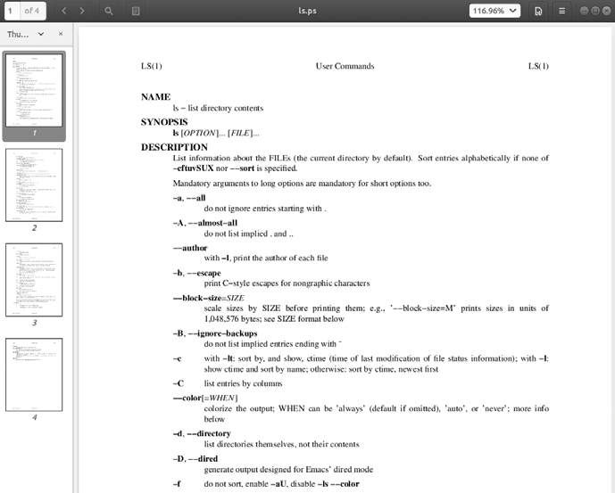
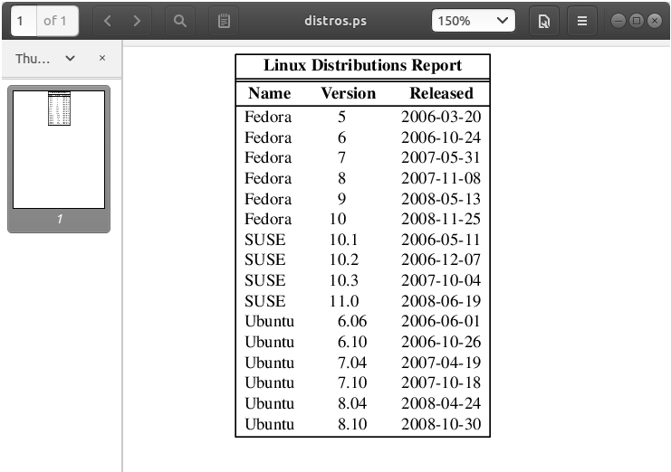

# Formato de salida

En este capítulo, continuamos con nuestro análisis de las herramientas relacionadas con el texto, centrándonos en los programas que se utilizan para formatear la salida de texto, en lugar de cambiar el texto en sí. Estas herramientas se utilizan a menudo para preparar texto para una eventual impresión, un tema que cubriremos en el próximo capítulo. Cubriremos los siguientes programas en este capítulo:
_____________
> Programa | Descripcion general
> ---------|---------------|
> n1 | Número de lineas
> fold | Wrap each line to a specified length (Envuelva cada línea a una longitud especificada)
> fmt | A simple text formatter / Un formateador de texto simple
> pr | Prepare text for printing / preparar texto para imprimier
> printf | Format and print data / formatear e imprimir datos
> groff | A document formatting system / Un sistema de formato de documentos
____________

# Herramientas de formato simples / Simple Formatting Tools

Primero veremos algunas de las herramientas de formato simples. Estos son en su mayoría programas de un solo propósito y un poco poco sofisticados en lo que hacen, pero se pueden usar para pequeñas tareas y como partes de pipelines y scripts.

## **nl**—Number Lines / Número de lineas

El programa nl es una herramienta bastante arcana que se utiliza para realizar una tarea sencilla. Numera líneas. En su uso más simple, se parece a cat -n.
___
```
[]$ nl distros.txt | head
1 SUSE 10.2 12/07/2006
....
```
______
Como cat, nl puede aceptar varios archivos como argumentos de línea de comando o como entrada estándar. Sin embargo, nl tiene varias opciones y admite una forma primitiva de marcado para permitir tipos de numeración más complejos.

nl admite un concepto llamado páginas lógicas al numerar. Esto permite a nl restablecer (comenzar de nuevo) la secuencia numérica al numerar. Usando opciones, es posible establecer el número de inicio en un valor específico y, hasta cierto punto, su formato. Una página lógica se divide en un encabezado, cuerpo y pie de página. Dentro de cada una de estas secciones, la numeración de líneas puede reiniciarse y / o asignarse un estilo diferente. Si nl recibe varios archivos, los trata como un solo flujo de texto. Las secciones en el flujo de texto se indican mediante la presencia de un marcado de aspecto bastante extraño agregado al texto, como se describe en la Tabla 21-1.
________
Table 21-1: nl Markup
Markup | Meaning
-------|-----------|
\\:\\: \\: | Inicio del encabezado de página lógica
\\:\\: | Inicio del cuerpo de la página lógica
\\: | Inicio del pie de página lógico
_______
Cada uno de los elementos de marcado enumerados en la Tabla 21-1 debe aparecer solo en su propia línea. Después de procesar un elemento de marcado, nl lo elimina del flujo de texto.

La Tabla 21-2 enumera las opciones comunes para nl.

Table 21-2: Opciones comunes de nl
__________
Opción | Significado/Descripción
-------|---------------|
-b style |Set body numbering to style , where style is one of the following: a = Number all lines. t = Number only non-blank lines. This is the default. n = None. pregexp = Number only lines matching basic regular expression regexp .
-f style | Set footer numbering to style . The default is n (none).
-h style | Set header numbering to style . The default is n (none).
-i number | Set page numbering increment to number. The default is 1.
-n format | Sets numbering format to format , where format is one of the following: ln = Left justified, without leading zeros. rn = Right justified, without leading zeros. This is the default. rz = Right justified, with leading zeros.
-p | Do not reset page numbering at the beginning of each logical page.
-s string | Add string to the end of each line number to create a separator. The default is a single tab character.
-v number | Set the first line number of each logical page to number . The default is 1.
-w width | Set the width of the line number field to width . The default is 6.
___________
Es cierto que probablemente no vamos a enumerar líneas con tanta frecuencia, pero podemos usar nl para ver cómo podemos combinar varias herramientas para realizar tareas más complejas. Nos basaremos en nuestro trabajo en el capítulo anterior para producir un informe de distribuciones de Linux. Dado que usaremos nl, será útil incluir su marcado de encabezado/cuerpo/pie de página. Para hacer esto, lo agregaremos al script sed del capítulo anterior. Usando nuestro editor de texto, cambiaremos el script de la siguiente manera y lo guardaremos como distros-nl.sed:
________
```
# sed script to produce Linux distributions report
1 i\
\\:\\:\\:\
\
Linux Distributions Report\
\
Name
Ver. Released\
----
---- --------\
\\:\\:
s/\([0-9]\{2\}\)\/\([0-9]\{2\}\)\/\([0-9]\{4\}\)$/\3-\1-\2/
$ a\
\\:\
\
End Of Report
```
____
The script now inserts the nl logical page markup and adds a footer at the end of the report. Note that we had to double up the backslashes in our markup because they are normally interpreted as an escape character by sed.

Next, we’ll produce our enhanced report by combining sort, sed, and nl.
______
```
[~]$ sort -k 1,1 -k 2n distros.txt | sed -f distros-nl.sed | nl
Linux Distributions Report

    Name    Ver.   Released
    ----    ----    --------
1 Fedora     5     2006-03-20
2 Fedora     6     2006-10-24
3 Fedora     7     2007-11-08
4 Fedora     8     2007-05-31
5 Fedora     9     2008-05-13
6 Fedora    10     2008-11-25
7 SUSE      10.1   2006-05-11
8 SUSE      10.2   2006-12-07
9 SUSE      10.3   2007-10-04
10 SUSE     11.0   2008-06-19
11 Ubuntu   6.06   2006-06-01
12 Ubuntu   6.10   2006-10-26
13 Ubuntu   7.04   2007-04-19
14 Ubuntu   7.10   2007-10-18
15 Ubuntu   8.04   2008-04-24
16 Ubuntu   8.10   2008-10-30

End Of Report
```
__________
Nuestro informe es el resultado de nuestra línea de comandos. Primero, ordenamos la lista por nombre de distribución y versión (campos 1 y 2), y luego procesamos los resultados con sed, agregando el encabezado del informe (incluido el marcado de página lógica para nl) y el pie de página. Finalmente, procesamos el resultado con nl, que, por defecto, solo numera las líneas del flujo de texto que pertenecen a la sección del cuerpo de la página lógica.
Podemos repetir el comando y experimentar con diferentes opciones para nl. Algunas interesantes son las siguientes:
____
```
nl -n rz
```
_______
y lo siguiente:
______
```
nl -w 3 -s ' '
```
_____
## fold — Envuelva cada línea a una longitud especificada / Wrap Each Line to a Specified Length

Folding is the process of breaking lines of text at a specified width. Like our other commands, fold accepts either one or more text files or standard input. If we send fold a simple stream of text, we can see how it works.
__________
```
[~]$ echo "The quick brown fox jumped over the lazy dog." | fold -w 12
The quick br
own fox jump
ed over the
lazy dog.
```
______
Here we see fold in action. The text sent by the echo command is broken into segments specified by the -w option. In this example, we specify a line width of 12 characters. If no width is specified, the default is 80 characters.
Notice how the lines are broken regardless of word boundaries. The addition of the -s option will cause fold to break the line at the last available space before the line width is reached.
________
```
[~]$ echo "The quick brown fox jumped over the lazy dog." | fold -w 12 -s
The quick
brown fox
jumped over
the lazy
dog.
```
______

## **fmt** — Un formateador de texto simle / A Simple Text Formatter

El programa fmt también pliega texto y mucho más. Acepta archivos o entradas estándar y formatea párrafos en el flujo de texto.
Básicamente, llena y une líneas en texto mientras conserva líneas en blanco y sangría.

Para demostrarlo, necesitaremos algo de texto. Saquemos algunos de la página de información de fmt.
_____
```
`fmt' reads from the specified FILE arguments (or standard input if none are given), and writes to standard output.
By default, blank lines, spaces between words, and indentation are preserved in the output; successive input lines with different indentation are not joined; tabs are expanded on input and introduced on output.
`fmt' prefers breaking lines at the end of a sentence, and tries to avoid line breaks after the first word of a sentence or before the last word of a sentence. A "sentence break" is defined as either the end of a paragraph or a word ending in any of `.?!', followed by two spaces or end of line, ignoring any intervening parentheses or quotes. Like TeX, `fmt' reads entire "paragraphs" before choosing line breaks; the algorithm is a variant of that given by Donald E. Knuth and Michael F. Plass in "Breaking Paragraphs Into Lines", `Software--Practice & Experience' 11, 11 (November 1981), 1119-1184.
```
-----
Copiaremos este texto en nuestro editor de texto y guardaremos el archivo como fmt-info.txt. Ahora, digamos que queremos reformatear este texto para que quepa en una columna de 50 caracteres de ancho. Podríamos hacer esto procesando el archivo con fmt y la opción -w.
__________
```
[~]$ fmt -w 50 fmt-info.txt | head
`fmt' reads from the specified FILE arguments
(or standard input if
none are given), and writes to standard output.
By default, blank lines, spaces between words,
and indentation are
preserved in the output; successive input lines
with different indentation are not joined; tabs
are expanded on input and introduced on output.
```
_______
Bueno, ese es un resultado incómodo. Quizás deberíamos leer este texto, ya que explica lo que está pasando.

> De forma predeterminada, las líneas en blanco, los espacios entre palabras y la sangría se conservan en la salida; las líneas de entrada sucesivas con sangría diferente no se unen; las pestañas se expanden en la entrada y se introducen en la salida.

Por tanto, fmt conserva la sangría de la primera línea. Afortunadamente, fmt ofrece una opción para corregir esto.
_______
```
[~]$ fmt -cw 50 fmt-info.txt
`fmt' reads from the specified FILE arguments (or standard input if none are given), and writes to standard output.
By default, blank lines, spaces between words, and indentation are preserved in the output; successive input lines with different indentation are not joined; tabs are expanded on input and introduced on output.
`fmt' prefers breaking lines at the end of a sentence, and tries to avoid line breaks after the first word of a sentence or before the last word of a sentence. A "sentence break" is defined as either the end of a paragraph or a word ending in any of `.?!', followed by two spaces or end of line, ignoring any intervening parentheses or quotes. Like TeX, `fmt' reads entire "paragraphs" before choosing line breaks; the algorithm is a variant of that given by Donald E. Knuth and Michael F.
Plass in "Breaking Paragraphs Into Lines", `Software--Practice & Experience' 11, 11 (November 1981), 1119-1184.
```
________
Eso está mucho mejor. Al agregar la opción -c, ahora tenemos el resultado deseado.
fmt tiene algunas opciones interesantes, como se describe en la Tabla 21-3.
____

Table 21-3: Opciones fmt

Opción | Descripción
-------|-------------|
-c | Opere en modo de margen de corona. Esto conserva la sangría de las dos primeras líneas de un párrafo. Las líneas siguientes se alinean con la sangría de la segunda línea.
-p string | Formatee solo aquellas líneas que comienzan con la cadena de prefijo. Después de formatear, el contenido de la cadena se antepone a cada línea reformateada. Esta opción se puede utilizar para dar formato al texto en los comentarios del código fuente. Por ejemplo, cualquier lenguaje de programación o archivo de configuración que use un carácter # para delinear un comentario podría formatearse especificando -p '#' para que solo se formatee los comentarios. Vea el ejemplo que sigue.
-s | Modo solo dividido. En este modo, las líneas solo se dividirán para ajustarse al ancho de columna especificado. Las líneas cortas no se unirán para llenar las líneas. Este modo es útil cuando se formatea texto como código donde no se desea unirse.
-u | Realice un espaciado uniforme. Esto aplicará el formato tradicional de "estilo de máquina de escribir" al texto. Esto significa un solo espacio entre palabras y dos espacios entre oraciones. Este modo es útil para eliminar la justificación, es decir, el texto que se ha rellenado con espacios para forzar la alineación en los márgenes izquierdo y derecho.
-w width | Formatee el texto para que se ajuste al ancho de una columna de caracteres. El valor predeterminado es 75 caracteres. Nota: fmt da formato a las líneas ligeramente más cortas que el ancho especificado para permitir el equilibrio de líneas.
_________
La opción -p es particularmente interesante. Con él, podemos formatear partes seleccionadas de un archivo, siempre que las líneas a formatear comiencen todas con la misma secuencia de caracteres. Muchos lenguajes de programación usan el signo de almohadilla (#) para indicar el comienzo de un comentario y, por lo tanto, se pueden formatear con esta opción. Creemos un archivo que simule un programa que usa comentarios.
______
```
[~]$ cat > fmt-code.txt
# This file contains code with comments.
# This line is a comment.
# Followed by another comment line.
# And another.
This, on the other hand, is a line of code.
And another line of code.
And another.
```
_____
Nuestro archivo de muestra contiene comentarios que comienzan con la cadena # (un # seguido de un espacio) y líneas de "código" que no lo hacen. Ahora, usando fmt, podemos formatear los comentarios y dejar el código intacto.
____
```
[~]$ fmt -w 50 -p '# ' fmt-code.txt
# This file contains code with comments.

# This line is a comment. Followed by another
# comment line. And another.
This, on the other hand, is a line of code.
And another line of code.
And another.
```
_______
Observe que las líneas de comentarios contiguas están unidas, mientras que las líneas en blanco y las líneas que no comienzan con el prefijo especificado se conservan.

## **pr** — Dar formato al texto para imprimir

El programa **pr** se utiliza para paginar texto. Al imprimir texto, a menudo es conveniente separar las páginas de salida con varias líneas de espacio en blanco para proporcionar un margen superior y un margen inferior para cada página. Además, este espacio en blanco se puede utilizar para insertar un encabezado y un pie de página en cada página.
Demostraremos pr formateando nuestro archivo distros.txt en una serie de páginas cortas (solo se muestran las dos primeras páginas).
________
```
[~]$ pr -l 15 -w 65 distros.txt

2016-12-11 18:27   distros.txt Page 1

SUSE 10.2    12/07/2006
Fedora 10    11/25/2008
SUSE 11.0    06/19/2008
Ubuntu 8.04  04/24/2008
Fedora 8     11/08/2007

2016-12-11 18:27  distros.txt  Page 2

SUSE 10.3     10/04/2007
Ubuntu 6.10   10/26/2006
Fedora 7      05/31/2007
Ubuntu 7.10   10/18/2007
Ubuntu 7.04   04/19/2007
```
_________
En este ejemplo, empleamos la opción -l (para longitud de página) y la opción -w (ancho de página) para definir una “página” que tiene 65 columnas de ancho y 15 líneas de largo. pr pagina el contenido del archivo distros.txt, separa cada página con varias líneas de espacio en blanco y crea un encabezado predeterminado que contiene la hora de modificación del archivo, el nombre del archivo y el número de página. El programa pr proporciona muchas opciones para controlar el diseño de la página, que veremos en el Capítulo 22.

## printf — Formatear e imprimir datos

A diferencia de los otros comandos de este capítulo, el comando printf no se usa para pipelines (no acepta entrada estándar) ni encuentra aplicaciones frecuentes directamente en la línea de comando (se usa principalmente en scripts). Entonces, ¿por qué es importante? Porque es muy utilizado.
printf (de la frase print formatted) se desarrolló originalmente para el lenguaje de programación C y se ha implementado en muchos lenguajes de programación, incluido el shell. De hecho, en bash, printf es un archivo incorporado. printf funciona así:
_____
```
printf "format" arguments
```
______
El comando recibe una cadena que contiene una descripción de formato, que luego se aplica a una lista de argumentos. El resultado formateado se envía a la salida estándar. Aquí hay un ejemplo trivial:
______
```
[~]$ printf "I formatted the string: %s\n" foo
I formatted the string: foo
```
____
La cadena de formato puede contener texto literal (como "Formateé la cadena:"), secuencias de escape (como \ n, un carácter de nueva línea) y secuencias que comienzan con el carácter%, que se denominan especificaciones de conversión. En el ejemplo anterior, la especificación de conversión% s se usa para formatear la cadena "foo" y colocarla en la salida del comando. Aquí está otra vez:
___
```
[~]$ printf "I formatted '%s' as a string.\n" foo
I formatted 'foo' as a string.
```
____
Como podemos ver, la especificación de conversión% s se reemplaza por la cadena "foo" en la salida del comando. La conversión s se utiliza para formatear datos de cadena. Hay otros especificadores para otros tipos de datos. La Tabla 21-4 enumera los tipos de datos más utilizados.
____
Table 21-4: Especificadores de tipo de datos comunes de printf

Especificador | Descripcion
-----------|-------------|
d | Formatee un número como un entero decimal con signo.
f | Formatee y genere un número de punto flotante.
o | Formatea un entero como un número octal.
s | Formatee una cadena.
x | Formatee un número entero como un número hexadecimal usando minúsculas de la a af cuando sea necesario.
X | Igual que x pero usa letras mayúsculas.
% | Imprima un símbolo% literal (es decir, especifique %%).
______
Demostraremos el efecto de cada uno de los especificadores de conversión en la cadena 380.
___
```
[~]$ printf "%d, %f, %o, %s, %x, %X\n" 380 380 380 380 380 380
380, 380.000000, 574, 380, 17c, 17C
```
____
Debido a que especificamos seis especificadores de conversión, también debemos proporcionar seis argumentos para que printf los procese. Los seis resultados muestran el efecto de cada especificador.
Se pueden agregar varios componentes opcionales al especificador de conversión para ajustar su salida. Una especificación de conversión completa puede constar de lo siguiente:
____
```
%[flags][width][.precision]conversion_specification
```
____
Múltiples componentes opcionales, cuando se utilizan, deben aparecer en el orden especificado anteriormente para ser interpretados correctamente. La Tabla 21-5 describe cada uno.
___
Table 21-5: Componentes de la especificación de conversión de printf
_____
Componente | Descripcion
------------|--------------|
flags | Hay cinco banderas diferentes: #: use el formato alternativo para la salida. Esto varía según el tipo de datos. Para la conversión de o (número octal), la salida tiene el prefijo 0. Para las conversiones x y X (número hexadecimal), la salida tiene el prefijo 0x o 0X, respectivamente. 0 (cero): rellena la salida con ceros. Esto significa que el campo se rellenará con ceros a la izquierda, como en 000380. - (guión): alinee la salida a la izquierda. De forma predeterminada, printf alinea la salida a la derecha. '' (espacio): Produce un espacio inicial para números positivos. + (signo más): firma números positivos. De forma predeterminada, printf solo firma números negativos.
width | Un número que especifica el ancho mínimo del campo.
.precision | Para números de coma flotante, especifique el número de dígitos de precisión que se emitirán después del punto decimal. Para la conversión de cadenas, la precisión especifica el número de caracteres a generar.
______

______
Table 21-6: Ejemplos de especificación de conversión de printf
___
Argumento | Formato | Resultado | Notas
-------|--------|--------|---------|
380 | "%d" | 380 | Formateo simple de un entero.
380 | "%#x" | 0x17c | Entero formateado como un número hexadecimal usando el indicador de "formato alternativo".
380 | "%05d" | 00380 | Entero formateado con ceros a la izquierda (relleno) y un ancho de campo mínimo de cinco caracteres.
380 | "%05.5f" | 380.00000 | Número formateado como un número de punto flotante con relleno y cinco posiciones decimales de precisión. Dado que el ancho de campo mínimo especificado (5) es menor que el ancho real del número formateado, el relleno no tiene ningún efecto.
380 | "%010.5f" | 0380.00000 | Al aumentar el ancho de campo mínimo a 10, el relleno ahora es visible.
380 | "%+d" | +380 | La bandera + firma un número positivo.
380 | "%-d" | 380 | El indicador - alinea a la izquierda el formato.
abcdefghijk | "%5s" | abcedfghijk | Una cadena formateada con un campo mínimo
anchura.
abcdefghijk | "%.5s" | abcde | Al aplicar precisión a una cadena, se trunca.
________
Nuevamente, printf se usa principalmente en scripts donde se emplea para formatear datos tabulares, en lugar de hacerlo directamente en la línea de comandos. Pero aún podemos mostrar cómo se puede usar para resolver varios problemas de formato. Primero, produzcamos algunos campos separados por tabulaciones.
___
```
[me@linuxbox ~]$ printf "%s\t%s\t%s\n" str1 str2 str3
str1 str2 str3
```
____
Al insertar \ t (la secuencia de escape de una pestaña), logramos el efecto deseado. A continuación, aquí hay algunos números con un formato ordenado:
___
```
[~]$ printf "Line: %05d %15.3f Result: %+15d\n" 1071 3.14156295 32589
Line:  3.142 Result: +32589
```
___
Esto muestra el efecto del ancho de campo mínimo en el espaciado de los campos. ¿O qué tal formatear una pequeña página web?
___
```
[~]$ printf "<html>\n\t<head>\n\t\t<title>%s</title>\n\t</head>\n\t<body>\n\t\t<p>%s</p>\n\t</body>\n</html>\n" "Page Title" "Page Content"

<html>
    <head>
        <title>Page Title</title>
    </head>
    <body>
        <p>Page Content</p>
    </body>
</html>
```
____

# Sistemas de formato de documentos

Hasta ahora, hemos examinado las herramientas simples de formato de texto. Estos son buenos para tareas pequeñas y simples, pero ¿qué pasa con los trabajos más grandes? Una de las razones por las que Unix se convirtió en un sistema operativo popular entre los usuarios técnicos y científicos (además de proporcionar un poderoso entorno multitarea y multiusuario para todo tipo de desarrollo de software) es que ofrecía herramientas que podían usarse para producir muchos tipos de documentos, particularmente Publicaciones científicas y académicas. De hecho, como describe la documentación de GNU, la preparación de documentos fue fundamental para el desarrollo de Unix.
La primera versión de UNIX se desarrolló en un PDP-7 que estaba en Bell Labs. En 1971, los desarrolladores querían obtener un PDP-11 para seguir trabajando en el sistema operativo. Para justificar el costo de este sistema, propusieron implementar un sistema de formato de documentos para la división de patentes de AT&T. Este primer programa de formateo fue una reimplementación del roff de McIllroy, escrito por J. F. Ossanna.
Dos familias principales de formateadores de documentos dominan el campo: los que descienden del programa roff original, incluidos nroff y troff, y los que se basan en el sistema de composición tipográfica TEX (pronunciado "tek") de Donald Knuth. Y sí, la E caída en el medio es parte de su nombre.
El nombre roff se deriva del término run off como en, "Te daré una copia". El programa nroff se utiliza para formatear documentos para enviarlos a dispositivos que utilizan fuentes monoespaciadas, como terminales de caracteres e impresoras tipo máquina de escribir. En el momento de su introducción, esto incluía casi todos los dispositivos de impresión conectados a las computadoras. El último programa troff da formato a los documentos para su salida en tipográficas, dispositivos que se utilizan para producir tipos "listos para la cámara" para la impresión comercial. La mayoría de las impresoras informáticas de hoy en día pueden simular la salida de los tipógrafos. La familia roff también incluye algunos otros programas que se utilizan para preparar partes de documentos.
Estos incluyen eqn (para ecuaciones matemáticas) y tbl (para tablas).
El sistema T EX (en forma estable) apareció por primera vez en 1989 y, hasta cierto punto, ha desplazado a troff como la herramienta de elección para la producción tipográfica.
No cubriremos TEX aquí, tanto por su complejidad (hay libros completos al respecto) como porque no está instalado por defecto en la mayoría de los sistemas Linux modernos.

> ***Consejo:***

> Para aquellos interesados en instalar TEX, consulte el paquete texlive, que se puede encontrar en la mayoría de los repositorios de distribución, y el editor de contenido gráfico LyX.
______
## **groff**
**groff** es un conjunto de programas que contienen la implementación GNU de troff. También incluye un script que se usa para emular a nroff y al resto de la familia roff.
Si bien roff y sus descendientes se utilizan para crear documentos formateados, lo hacen de una manera que es bastante extraña para los usuarios modernos. La mayoría de los documentos actuales se producen utilizando procesadores de texto que pueden realizar tanto la composición como el diseño de un documento en un solo paso. Antes de la llegada del procesador de texto gráfico, los documentos se producían a menudo en un proceso de dos pasos que implicaba el uso de un editor de texto para realizar la composición y un procesador, como troff, para aplicar el formato. Las instrucciones para el programa de formato se integraron en el texto compuesto mediante el uso de un lenguaje de marcado. El análogo moderno de tal proceso es la página web, que se compone con un editor de texto de algún tipo y luego se representa mediante un navegador web utilizando HTML como lenguaje de marcado para describir el diseño de la página final.
No vamos a cubrir groff en su totalidad, ya que muchos elementos de su lenguaje de marcado tratan con detalles bastante arcanos de la tipografía. En cambio, nos concentraremos en uno de sus paquetes de macros que sigue siendo de uso generalizado. Estos paquetes de macros condensan muchos de sus comandos de bajo nivel en un conjunto más pequeño de comandos de alto nivel que facilitan mucho el uso de groff.
Por un momento, consideremos la humilde página de manual. Vive en el directorio /usr/share/ man como un archivo de texto comprimido con gzip. Si examináramos su contenido sin comprimir, veríamos lo siguiente (se muestra la página de manual de ls en la sección 1):
____
```
[~]$ zcat /usr/share/man/man1/ls.1.gz | head
.\" DO NOT MODIFY THIS FILE! It was generated by help2man 1.47.3.
.TH LS "1" "January 2018" "GNU coreutils 8.28" "User Commands"
.SH NAME
ls \- list directory contents
.SH SYNOPSIS
.B ls
[\fI\,OPTION\/\fR]... [\fI\,FILE\/\fR]...
.SH DESCRIPTION
.\" Add any additional description here
.PP
```
______
En comparación con la página de manual en su presentación normal, podemos comenzar a ver una correlación entre el lenguaje de marcado y sus resultados.
___
```
[~]$ man ls | head
LS(1) User Commands LS(1)

NAME
    ls - list directory contents
SYNOPSIS
    ls [OPTION]... [FILE]...
```
_____
La razón por la que esto es de interés es que las páginas de manual son renderizadas por groff, usando el paquete de macros mandoc. De hecho, podemos simular el comando man con la siguiente canalización:
___
```
[~]$ zcat /usr/share/man/man1/ls.1.gz | groff -mandoc -T ascii | head
LS(1) User Commands LS(1)
NAME
    ls - list directory contents
SYNOPSIS
    ls [OPTION]... [FILE]...
```
____
Aquí usamos el programa groff con las opciones configuradas para especificar el paquete de macros mandoc y el controlador de salida para ASCII. groff puede producir resultados en varios formatos. Si no se especifica ningún formato, se genera PostScript de forma predeterminada.
___
```
[~]$ zcat /usr/share/man/man1/ls.1.gz | groff -mandoc | head
%!PS-Adobe-3.0
%%Creator: groff version 1.18.1
%%CreationDate: Thu Feb 5 13:44:37 2009
%%DocumentNeededResources: font Times-Roman
%%+ font Times-Bold
%%+ font Times-Italic
%%DocumentSuppliedResources: procset grops 1.18 1
%%Pages: 4
%%PageOrder: Ascend
%%Orientation: Portrait
```
____
Mencionamos brevemente PostScript en el capítulo anterior y lo haremos nuevamente en el capítulo siguiente. PostScript es un lenguaje de descripción de página que se utiliza para describir el contenido de una página impresa en un dispositivo tipográfico.
Si tomamos la salida de nuestro comando y la almacenamos en un archivo (asumiendo que estamos usando un escritorio gráfico con un directorio de Escritorio), debería aparecer un icono para el archivo de salida en el escritorio.
___
```
[~]$ zcat /usr/share/man/man1/ls.1.gz | groff -mandoc > ~/Desktop/ls.ps
```
___
Al hacer doble clic en el icono, un visor de páginas debe iniciarse y revelar el archivo en su forma renderizada, como se muestra en la Figura 21-1.
Lo que vemos es una página de manual muy bien escrita para ls. De hecho, es posible convertir el archivo PostScript en un archivo de formato de documento portátil (PDF) con este comando:
___
```
[~]$ ps2pdf ~/Desktop/ls.ps ~/Desktop/ls.pdf
```
___
El programa ps2pdf es parte del paquete ghostscript, que se instala en la mayoría de los sistemas Linux que admiten la impresión.
____

Figura 21-1: Visualización de la salida PostScript con un visor de páginas en GNOME
___
> ***Consejo***

> Los sistemas Linux a menudo incluyen muchos programas de línea de comandos para la conversión de formatos de archivo. A menudo se nombran utilizando la convención de format2format. Intente usar el comando ls /usr/bin/ * [[:alpha:]]2[[:alpha:]]* para identificarlos. También intente buscar programas llamados formattoformat.

Para nuestro último ejercicio con groff, volveremos a visitar nuestro viejo amigo distros.txt. Esta vez, usaremos el programa tbl, que se usa para formatear tablas para componer nuestra lista de distribuciones de Linux. Para hacer esto, usaremos nuestro script sed anterior para agregar marcado a un flujo de texto que alimentaremos a groff. Primero, necesitamos modificar nuestro script sed para agregar los elementos de marcado necesarios (llamados solicitudes en groff) que tbl requiere. Usando un editor de texto, cambiaremos distros.sed a lo siguiente:
______
```
# sed script to produce Linux distributions report
1 i\
.TS\
center box;\
cb s s\
cb cb cb\
l n c.\
Linux Distributions Report\
=\
Name     Version    Released\
_
s/\([0-9]\{2\}\)\/\([0-9]\{2\}\)\/\([0-9]\{4\}\)$/\3-\1-\2/
$ a\
.TE
```
___
Tenga en cuenta que para que la secuencia de comandos funcione correctamente, se debe tener cuidado de que las palabras Nombre Versión publicada estén separadas por tabulaciones, no por espacios. Guardaremos el archivo resultante como distros-tbl.sed. tbl usa las solicitudes .TS y .TE para iniciar y finalizar la tabla. Las filas que siguen a la solicitud .TS definen propiedades globales de la tabla, que, para nuestro ejemplo, están centradas horizontalmente en la página y rodeadas por un cuadro. Las líneas restantes de la definición describen el diseño de cada fila de la tabla. Ahora, si volvemos a ejecutar nuestra canalización de generación de informes con la nueva secuencia de comandos sed, obtendremos lo siguiente:
_____
```
[me@linuxbox ~]$ sort -k 1,1 -k 2n distros.txt | sed -f distros-tbl.sed | groff -t -T ascii
+------------------------------+
| Linux Distributions Report
|
+------------------------------+
| Name    Version  Released |
+------------------------------+
|Fedora     5    2006-03-20 |
..........
```
___
Agregar la opción -t a groff le indica que preprocese el flujo de texto con tbl. Del mismo modo, la opción -T se utiliza para enviar a ASCII en lugar del medio de salida predeterminado, PostScript.
El formato de salida es el mejor que podemos esperar si estamos limitados a las capacidades de una pantalla de terminal o una impresora estilo máquina de escribir. Si especificamos la salida PostScript y visualizamos gráficamente la salida, obtenemos un resultado mucho más satisfactorio, como se muestra en la Figura 21-2.
___
```
[~]$ sort -k 1,1 -k 2n distros.txt | sed -f distros-tbl.sed |
groff -t > ~/Desktop/distros.ps
```
___

Figura 21-2: Visualización de la mesa terminada
____
