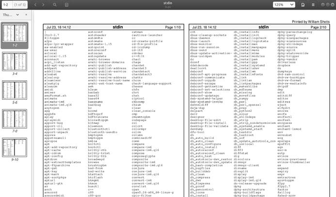

# 22 - Printing
After spending the last couple of chapters manipulating text, it’s time to put that text on paper. In this chapter, we’ll look at the command line tools that are used to print files and control printer operation. We won’t be looking at how to configure printing because that varies from distribution to distribution and is usually set up automatically during installation. Note that we will need a working printer configuration to perform the exercises in this chapter.

We will discuss the following commands:
____
Comando | Descripción
----------|---------|
pr | Convert text files for printing
lpr | Print files
a2ps | Format files for printing on a PostScript | printer
lpstat | Show printer status information
lpq | Show printer queue status
lprm | Cancel print jobs
____

# A Brief History of Printing
To fully understand the printing features found in Unix-like operating systems, we must first learn some history. Printing on Unix-like systems goes way back to the beginning of the operating system. In those days, printers and how they were used were much different from today.

## Printing in the Dim Times
Like computers, printers in the pre-PC era tended to be large, expensive, and centralized. The typical computer user of 1980 worked at a terminal connected to a computer some distance away. The printer was located near the computer and was under the watchful eyes of the computer’s operators. 
When printers were expensive and centralized, as they often were in the early days of Unix, it was common practice for many users to share a printer. To identify print jobs belonging to a particular user, a banner page displaying the name of the user was often printed at the beginning of each print job. The computer support staff would then load up a cart containing the day’s print jobs and deliver them to the individual users.

# Character-Based Printers
The printer technology of the 1980s was very different from today in two respects. First, printers of that period were almost always impact printers.
Impact printers use a mechanical mechanism that strikes a ribbon against the paper to form character impressions on the page. Two of the popular technologies of that time were daisy-wheel printing and dot-matrix printing.
The second, and more important, characteristic of early printers was that printers used a fixed set of characters that were intrinsic to the device.
For example, a daisy-wheel printer could print only the characters actually molded into the petals of the daisy wheel. This made the printers much like high-speed typewriters. As with most typewriters, they printed using monospaced (fixed-width) fonts. This means that each character has the same width. Printing was done at fixed positions on the page, and the printable area of a page contained a fixed number of characters. Most printers printed 10 characters per inch (CPI) horizontally and 6 lines per inch (LPI) vertically. Using this scheme, a US-letter sheet of paper is 85 characters wide and 66 lines high. Taking into account a small margin on each side, 80 characters was considered the maximum width of a print line. This explains why terminal displays (and our terminal emulators) are normally 80 characters wide. Using a monospaced font and an 80-character-wide terminal provides a what-you-see-is-what-you-get (WYSIWYG, pronounced “whizzy-wig”) view of printed output.
Data is sent to a typewriter-like printer in a simple stream of bytes containing the characters to be printed. For example, to print an a, the ASCII character code 97 is sent. In addition, the low-numbered ASCII control codes provided a means of moving the printer’s carriage and paper, using codes for carriage return, line feed, form feed, and so on.
Using the control codes, it’s possible to achieve some limited font effects, such as boldface, by having the printer print a character, backspace, and print the character again to get a darker print impression on the page. We can actually witness this if we use nroff to render a man page and examine the output using cat -A.
____
```
[~]$ zcat /usr/share/man/man1/ls.1.gz | nroff -man | cat -A | head
LS(1)
User Commands
LS(1)
$
$
$
N^HNA^HAM^HME^HE$
ls - list directory contents$
$
S^HSY^HYN^HNO^HOP^HPS^HSI^HIS^HS$
l^Hls^Hs [_^HO_^HP_^HT_^HI_^HO_^HN]... [_^HF_^HI_^HL_^HE]...$
```
______
The ^H ( ctrl -H) characters are the backspaces used to create the boldface effect. Likewise, we can also see a backspace/underscore sequence used to produce underlining.

## Graphical Printers
The development of GUIs led to major changes in printer technology. As computers moved to more picture-based displays, printing moved from character-based to graphical techniques. This was facilitated by the advent of the low-cost laser printer, which, instead of printing fixed characters, could print tiny dots anywhere in the printable area of the page. This made printing proportional fonts (like those used by typesetters), and even photographs and high-quality diagrams, possible. However, moving from a character-based scheme to a graphical scheme presented a formidable technical challenge. Here’s why: the number of bytes needed to fill a page using a character-based printer can be calculated this way (assuming 60 lines per page each containing 80 characters):

60 × 80 = 4,800 bytes

In comparison, a 300 dot per inch (DPI) laser printer (assuming an 8-by 10-inch print area per page) requires this many bytes:

(8 × 300) × (10 × 300) / 8 = 900,000 bytes

Many of the slow PC networks simply could not handle the nearly 1MB of data required to print a full page on a laser printer, so it was clear that a clever invention was needed.

That invention turned out to be the page description language (PDL). A page description language is a programming language that describes the contents of a page. Basically it says, “Go to this position, draw the character a in 10-point Helvetica, go to this position . . .” until everything on the page is described. The first major PDL was PostScript from Adobe Systems, which is still in wide use today. The PostScript language is a complete programming language tailored for typography and other kinds of graphics and imaging. It includes built-in support for 35 standard, high-quality fonts, plus the ability to accept additional font definitions at runtime. At first, support for PostScript was built into the printers themselves. This solved the data transmission problem. While the typical PostScript program was very verbose in comparison to the simple byte stream of character-based printers, it was much smaller than the number of bytes required to represent the entire printed page.

A PostScript printer accepted a PostScript program as input. The printer contained its own processor and memory (oftentimes making the printer a more powerful computer than the computer to which it was attached) and executed a special program called a PostScript interpreter, which read the incoming PostScript program and rendered the results into the printer’s internal memory, thus forming the pattern of bits (dots) that would be transferred to the paper. The generic name for this process of rendering something into a large bit pattern (called a bitmap) is raster image processor (RIP).

As the years went by, both computers and networks became much faster.

This allowed the RIP to move from the printer to the host computer, which, in turn, permitted high-quality printers to be much less expensive.

Many printers today still accept character-based streams, but many low-cost printers do not. They rely on the host computer’s RIP to provide a stream of bits to print as dots. There are still some PostScript printers, too.

# Printing with Linux
Modern Linux systems employ two software suites to perform and manage printing. The first, the Common Unix Printing System (CUPS), provides print drivers and print-job management, and the second, Ghostscript, a PostScript interpreter, acts as a RIP.

CUPS manages printers by creating and maintaining print queues. As we discussed in the earlier history lesson, Unix printing was originally designed to manage a centralized printer shared by multiple users. Since printers are slow by nature, compared to the computers that are feeding them, printing systems need a way to schedule multiple print jobs and keep things organized. CUPS also has the ability to recognize different types of data (within reason) and can convert files to a printable form.

# Preparing Files for Printing
As command line users, we are mostly interested in printing text, though it is certainly possible to print other data formats as well.
## **pr** — Convert Text Files for Printing
We looked at pr a little in the previous chapter. Now we will examine some of its many options used in conjunction with printing. In our history of printing, we saw how character-based printers use monospaced fonts, resulting in fixed numbers of characters per line and lines per page. pr is used to adjust text to fit on a specific page size, with optional page headers and margins. Table 22-1 summarizes its most commonly used options.
___
Table 22-1: Common pr Options

Option | Description
-------|-------------------|
+first[:last] | Output a range of pages starting with first and, optionally, ending with last .
-columns | Organize the content of the page into the number of columns specified by columns .
-a | By default, multicolumn output is listed vertically. By adding the -a(across) option, content is listed horizontally.
-d | Double-space output.
-D | format Format the date displayed in page headers using format . See the man page for the date command for a description of the format string.
-f | Use form feeds rather than carriage returns to separate pages.
-h | header In the center portion of the page header, use header rather than the name of the file being processed.
-l | length Set page length to length . The default is 66 (US letter at 6 lines per inch).
-n | Number lines.
-o offset | Create a left margin offset characters wide.
-w width | Set the page width to width . The default is 72.
________
pr is often used in pipelines as a filter. In this example, we will produce a directory listing of /usr/bin and format it into paginated, three-column
output using pr :
_____
```
[~]$ ls /usr/bin | pr -3 -w 65 | head
2016-02-18 14:00               Page 1
[             apturl        bsd-write
411toppm      ar            bsh
a2pa          record        btcflash
a2ps          arecordmidi   bug-buddy
a2ps-lpr-wrapper  ark      buildhash     
```
_____
# Sending a Print Job to a Printer
The CUPS printing suite supports two methods of printing historically used on Unix-like systems. One method, called Berkeley or LPD (used in the Berkeley Software Distribution version of Unix), uses the lpr program, while the other method, called SysV (from the System V version of Unix), uses the lp program. Both programs do roughly the same thing. Choosing one over the other is a matter of personal taste.

## **lpr** — Print Files (Berkeley Style)
The lpr program can be used to send files to the printer. It may also be used in pipelines, as it accepts standard input. For example, to print the results of our previous multicolumn directory listing, we could do this:
____
```
[~]$ ls /usr/bin | pr -3 | lpr
```
____
The report would be sent to the system’s default printer. To send the file to a different printer, the -P option can be used like this:
____
```
lpr -P printer_name
```
____
Here, printer_name is the name of the desired printer. To see a list of printers known to the system, use this:
____
```
[~]$ lpstat -a
```
_____
> Tip

> Many Linux distributions allow you to define a “printer” that outputs files to PDF, rather than printing on the physical printer. This is handy for experimenting with printing commands. Check your printer configuration program to see whether it supports this configuration. On some distributions, you may need to install additional packages (such as cups-pdf ) to enable this capability.
_______
Table 22-2 describes some of the common options for lpr.
_______
Table 22-2: Common lpr Options

Option | Description
-------------|----------|
-# number | Set number of copies to number.
-p | Print each page with a shaded header with the date, time, job name, and page number. This so-called pretty-print option can be used when printing text files.
-P | printer Specify the name of the printer used for output. If no printer is specified, the system’s default printer is used.
-r | Delete files after printing. This would be useful for programs that produce temporary printer-output files.
______
## **lp** — Print Files (System V Style)
Like lpr , lp accepts either files or standard input for printing. It differs from lpr in that it supports a different (and slightly more sophisticated) option set. Table 22-3 describes the common options.
____
Table 22-3: Common lp Options

Option | Description
---------|------------|
-d printer | Set the destination (printer) to printer . If no d option is specified, the system default printer is used.
-n number | Set the number of copies to number.
-o landscape | Set output to landscape orientation.
-o fitplot | Scale the file to fit the page. This is useful when printing images, such as JPEG files.
-o scaling=number | Scale file to number. The value of 100 fills the page. Values less than 100 are reduced, while values greater than 100 cause the file to be printed across multiple pages.
-o cpi=number | Set the output characters per inch to number . The default is 10.
-o lpi=number | Set the output lines per inch to number. The default is 6.
-o page-bottom=points| Set the page margins. Values are expressed in points, a unit of typographic measurement. There are 72 points to an inch.
-o page-left=points |
-o page-right=points |
-o  page-top=points | 
-P pages | Specify the list of pages. pages may be expressed as a comma-separated list and/or a range, for example, 1,3,5,7-10 .
_____
We’ll produce our directory listing again, this time printing 12 CPI and 8 LPI with a left margin of one-half inch. Note that we have to adjust the pr options to account for the new page size.
_____
```
[~]$ ls /usr/bin | pr -4 -w 90 -l 88 | lp -o page-left=36 -o cpi=12 -o lpi=8
```
_____
This pipeline produces a four-column listing using smaller type than the default. The increased number of characters per inch allows us to fit more columns on the page.
## Another Option: a2ps
The a2ps program (available in most distribution repositories) is interesting. As we can surmise from its name, it’s a format conversion program, but it's also much more. Its name originally meant “ASCII to PostScript,” and it was used to prepare text files for printing on PostScript printers. Over the years, however, the capabilities of the program have grown, and now its name means “Anything to PostScript.” While its name suggests a format-conversion program, it is actually a printing program. It sends its default output to the system’s default printer rather than standard output. The program’s default behavior is that of a “pretty printer,” meaning that it improves the appearance of output. We can use the program to create a PostScript file on our desktop.
___
```
[me@linuxbox ~]$ ls /usr/bin | pr -3 -t | a2ps -o ~/Desktop/ls.ps -L 66
[stdin (plain): 11 pages on 6 sheets]
[Total: 11 pages on 6 sheets] saved into the file `/home/me/Desktop/ls.ps'
```
____
Here we filter the stream with pr, using the -t option (omit headers and footers), and then with a2ps , specifying an output file ( -o option) and 66 lines per page ( -L option) to match the output pagination of pr . If we view the resulting file with a suitable file viewer, we will see the output in Figure 22-1.
____

Figure 22-1: Viewing a2ps output
___
As we can see, the default output layout is “two-up” format. This causes the contents of two pages to be printed on each sheet of paper. a2ps applies nice page headers and footers, too.

a2ps has a lot of options. Table 22-4 provides a summary.

Table 22-4: a2ps Options

Option | Description
-----------|-----------------|
--center-title=text |Set center page title to text.
--columns=number | Arrange pages into number columns. The default is 2.
--footer=text | Set page footer to text .
--guess | Report the types of files given as arguments. Since a2ps tries to convert and format all types of data, this option can be useful for predicting what a2ps will do when given a particular file.
--left-footer=text | Set the left-page footer to text .
--left-title=text | Set the left-page title to text .
--line-numbers=interval | Number lines of output every interval lines.
--list=defaults |Display default settings.
--pages=range | Print pages in range.
--right-footer=text | Set the right-page footer to text.
--right-title=text | Set the right-page title to text.
--rows=number | Arrange pages into number rows. The default is 1.
-B | No page headers.
-b | text Set the page header to text .
-f | size Use size point font.
-l | number Set characters per line to number . This and the -L option (see the next entry) can be used to make files paginated with other programs, such as pr , fit correctly on the page.
-L number | Set lines per page to number .
-M name | Use a media name, such as A4.
-n number | Output number copies of each page.
-o file | Send output to file . If file is specified as - , use standard
output.
-P printer | Use printer . If a printer is not specified, the system default printer is used.
-R | Portrait orientation.
-r | Landscape orientation.
-T number | Set tab stops to every number characters.
-u text | Underlay (watermark) pages with text.
_____
This is just a summary. a2ps has several more options.
> Note

> There is another output formatter that is useful for converting text into PostScript. Called enscript , it can perform many of the same kinds of formatting and printing tricks, but unlike a2ps , it accepts only text input.

# Monitoring and Controlling Print Jobs
As Unix printing systems are designed to handle multiple print jobs from multiple users, CUPS is designed to do the same. Each printer is given a print queue, where jobs are parked until they can be spooled to the printer.

CUPS supplies several command line programs that are used to manage printer status and print queues. Like the lpr and lp programs, these management programs are modeled after the corresponding programs from the Berkeley and System V printing systems.

## **lpstat** — Display Print System Status
The lpstat program is useful for determining the names and availability of printers on the system. For example, if we had a system with both a physical printer (named printer) and a PDF virtual printer (named PDF), we could check their status like this:
____
```
[~]$ lpstat -a
PDF accepting requests since Mon 08 Dec 2017 03:05:59 PM EST
printer accepting requests since Tue 24 Feb 2018 08:43:22 AM EST
```
____
Further, we could determine a more detailed description of the print system configuration this way:
___
```
[~]$ lpstat -s
system default destination: printer
device for PDF: cups-pdf:/
device for printer: ipp://print-server:631/printers/printer
```
___
In this example, we see that printer is the system’s default printer and that it is a network printer using Internet Printing Protocol (ipp://) attached to a system named print-server.
___
Table 22-5 describes some of the commonly useful options.
____
Table 22-5: Common lpstat Options

Option | Description
-----------|--------------------|
-a [printer...] | Display the state of the printer queue for printer . Note that this is the status of the printer queue’s ability to accept jobs, not the status of the physical printers. If no printers are specified, all print queues are shown.
-d | Display the name of the system’s default printer.
-p [printer...] | Display the status of the specified printer . If no printers are specified, all printers are shown.
-r | Display the status of the print server.
-s | Display a status summary.
-t | Display a complete status report.
______
## **lpq** — Display Printer Queue Status
To see the status of a printer queue, the lpq program is used. This allows us to view the status of the queue and the print jobs it contains. Here is an example of an empty queue for a system default printer named printer:
___
```
[~]$ lpq
printer is ready
no entries
```
____
If we do not specify a printer (using the -P option), the system’s default printer is shown. If we send a job to the printer and then look at the queue,we will see it listed.
___
```
[~]$ ls *.txt | pr -3 | lp
request id is printer-603 (1 file(s))
[~]$ lpq
printer is ready and printing
Rank  Owner  Job  File(s)   Total Size
active me   603   (stdin)   1024 bytes
```
___
## **lprm/cancel** — Cancel Print Jobs
CUPS supplies two programs used to terminate print jobs and remove them from the print queue. One is Berkeley style ( lprm ), and the other is System V( cancel ). They differ slightly in the options they support but do basically the same thing. Using our earlier print job as an example, we could stop the job and remove it this way:
____
```
[~]$ cancel 603
[~]$ lpq
printer is ready
no entries
```
___
Each command has options for removing all the jobs belonging to a particular user, particular printer, and multiple job numbers. Their respective man pages have all the details.