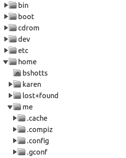

# <p style="text-align:center; color:red">2</p>
# <p style="text-align:center; color:red">Navigation<br /><span style="color:brown">Navegación</span></p>

The first thing we need to learn (besides how to type) is how to navigate the file system on our Linux system. In this chapter, we will introduce the following commands:<br /><span style="color:green">Lo primero que debemos aprender (además de cómo escribir) es cómo navegar por el sistema de archivos en nuestro sistema Linux. En este capítulo, presentaremos los siguientes comandos:</span>

pwd -- Print name of current working directory<br /><span style="color:green">  pwd -- Imprimir nombre del directorio de trabajo actual</span>

cd -- Change directory<br /><span style="color:green">cd -- Cambiar directorio</span>

ls -- List directory contents<br /><span style="color:green">ls -- Lista de contenidos del directorio</span>

# Understanding the File System Tree<br /><span style="color:yellow">Comprensión del árbol del sistema de archivos</span>

Like Windows, a Unix-like operating system such as Linux organizes its files in what is called a hierarchical directory structure. This means they are organized in a tree-like pattern of directories (sometimes called folders in other systems), which may contain files and other directories. The first directory in the file system is called the root directory. The root directory contains files and subdirectories, which contain more files and subdirectories, and so on.<br /><span style="color:green">Al igual que Windows, un sistema operativo similar a Unix como Linux organiza sus archivos en lo que se denomina una estructura de directorios jerárquica. Esto significa que están organizados en un patrón de directorios en forma de árbol (a veces llamadas carpetas en otros sistemas), que pueden contener archivos y otros directorios. El primer directorio del sistema de archivos se denomina directorio raíz. El directorio raíz contiene archivos y subdirectorios, que contienen más archivos y subdirectorios, etc.</span>

Note that unlike Windows, which has a separate file system tree for each storage device, Unix-like systems such as Linux always have a single file system tree, regardless of how many drives or storage devices are attached to the computer. Storage devices are attached (or more correctly, mounted) at various points on the tree according to the whims of the system administrator, the person (or people) responsible for the maintenance of the system.<br /><span style="color:green">Tenga en cuenta que, a diferencia de Windows, que tiene un árbol de sistema de archivos separado para cada dispositivo de almacenamiento, los sistemas similares a Unix, como Linux, siempre tienen un árbol de sistema de archivos único, independientemente de cuántas unidades o dispositivos de almacenamiento estén conectados a la computadora. Los dispositivos de almacenamiento están conectados (o más correctamente, montados) en varios puntos del árbol según los caprichos del administrador del sistema, la persona (o personas) responsable del mantenimiento del sistema.</span>


# The Current Working Directory<br /><span style="color:yellow">El directorio de trabajo actual</span>

Most of us are probably familiar with a graphical file manager that represents the file system tree, as illustrated in Figure 2-1.<br /><span style="color:green">La mayoría de nosotros probablemente estamos familiarizados con un administrador de archivos gráfico que representa el árbol del sistema de archivos, como se ilustra en la Figura 2-1.</span>



{Figure 2-1: File system tree as shown by a graphical file manager<br /><span style="color:green">Figura 2-1: Árbol del sistema de archivos mostrado por un administrador de archivos gráfico</span>}

Notice that the tree is usually shown upended, that is, with the root at the top and the various branches descending below.<br /><span style="color:green">Observe que el árbol generalmente se muestra invertido, es decir, con la raíz en la parte superior y las diversas ramas descendiendo hacia abajo.</span>

However, the command line has no pictures, so to navigate the filesystem tree, we need to think of it in a different way.<br /><span style="color:green">Sin embargo, la línea de comandos no tiene imágenes, por lo que para navegar por el árbol del sistema de archivos, debemos pensar en él de una manera diferente.</span>

Imagine that the file system is a maze shaped like an upside-down tree and we are able to stand in the middle of it. At any given time, we are inside a single directory, and we can see the files contained in the directory and the pathway to the directory above us (called the parent directory) and any subdirectories below us. The directory we are standing in is called the current working directory. To display the current working directory, we use the pwd (print working directory) command.<br /><span style="color:green">Imagínese que el sistema de archivos es un laberinto con la forma de un árbol al revés y podemos paramos en medio de él. En cualquier momento, estamos dentro de un único directorio y podemos ver los archivos contenidos en el directorio y la ruta al directorio que está encima de nosotros (llamado directorio principal) y cualquier subdirectorio debajo de nosotros. El directorio en el que nos encontramos se denomina directorio de trabajo actual. Para mostrar el directorio de trabajo actual, usamos el comando pwd (imprimir directorio de trabajo).</span>

```
[me@linuxbox ~]$ pwd
/home/me
```


When we first log in to our system (or start a terminal emulator session), our current working directory is set to our home directory. Each user account is given its own home directory, and it is the only place a regular user is  allowed to write files.<br /><span style="color:green">Cuando iniciamos sesión por primera vez en nuestro sistema (o iniciamos una sesión de emulador de terminal), nuestro directorio de trabajo actual se establece en nuestro directorio de inicio. A cada cuenta de usuario se le da su propio directorio de inicio, y es el único lugar donde un usuario regular puede escribir archivos.</span>


# Listing the Contents of a Directory<br /><span style="color:yellow">Listado del contenido de un directorio</span>

To list the files and directories in the current working directory, we use the ls command.<br /><span style="color:green">Para listar los archivos y directorios en el directorio de trabajo actual, usamos el comando ls</span>

```
[me@linuxbox ~]$ ls
Desktop Documents Music Pictures Public Templates Videos
```

Actually, we can use the ls command to list the contents of any directory, not just the current working directory, and there are many other fun things it can do as well. We’ll spend more time with ls in Chapter 3.<br /><span style="color:green">De hecho, podemos usar el comando ls para listar el contenido de cualquier directorio, no solo el directorio de trabajo actual, y hay muchas otras cosas divertidas que puede hacer también. Dedicaremos más tiempo a ls en el capítulo 3.</span>

# Changing the Current Working Directory<br /><span style="color:yellow">Cambio del directorio de trabajo actual</span>

To change our working directory (where we are standing in the tree-shaped maze), we use the cd command. To do this, type cd followed by the pathname of the desired working directory. A pathname is the route we take along the branches of the tree to get to the directory we want. We can specify pathnames in one of two different ways: as absolute pathnames or as relative pathnames. Let’s deal with absolute pathnames first.<br /><span style="color:green">Para cambiar nuestro directorio de trabajo (donde estamos parados en el laberinto en forma de árbol), usamos el comando cd. Para hacer esto, escriba cd seguido de la ruta del directorio de trabajo deseado. Un nombre de ruta es la ruta que tomamos a lo largo de las ramas del árbol para llegar al directorio que queremos. Podemos especificar nombres de ruta de dos formas diferentes: como nombres de ruta absolutos o como nombres de ruta relativos. Tratemos primero con los nombres de ruta absolutos.</span>

# Absolute Pathnames<br /><span style="color:yellow">Nombres de ruta absolutos</span>

An absolute pathname begins with the root directory and follows the tree branch by branch until the path to the desired directory or file is completed.<br /><span style="color:green">Un nombre de ruta absoluto comienza con el directorio raíz y sigue el árbol rama por rama hasta que se completa la ruta al directorio o archivo deseado.</span>

For example, there is a directory on your system in which most of the system’s programs are installed. The directory’s pathname is /usr/bin. This means from the root directory (represented by the leading slash in the pathname) there is a directory called usr that contains a directory called bin.<br /><span style="color:green">Por ejemplo, hay un directorio en su sistema en el que están instalados la mayoría de los programas del sistema. El nombre de la ruta del directorio es / usr / bin. Esto significa que desde el directorio raíz (representado por la barra inclinada en el nombre de la ruta) hay un directorio llamado usr que contiene un directorio llamado bin.</span>

```
[me@linuxbox ~]$ cd /usr/bin
[me@linuxbox bin]$ pwd
/usr/bin
[me@linuxbox bin]$ ls
...Listing of many, many files ...
```

Now we can see that we have changed the current working directory to /usr/bin and that it is full of files. Notice how the shell prompt has changed? As a convenience, it is usually set up to automatically display the name of the working directory.<br /><span style="color:green">Ahora podemos ver que hemos cambiado el directorio de trabajo actual a / usr / bin y que está lleno de archivos. ¿Observa cómo ha cambiado el indicador de shell? Para su comodidad, generalmente está configurado para mostrar automáticamente el nombre del directorio de trabajo.</span>

# Relative Pathnames<br /><span style="color:yellow">Nombres de ruta relativos</span>

Where an absolute pathname starts from the root directory and leads to its destination, a relative pathname starts from the working directory. To do this, it uses a couple of special notations to represent relative positions in the file system tree. These special notations are . (dot) and .. (dot dot).<br /><span style="color:green">Donde una ruta absoluta comienza desde el directorio raíz y conduce a su destino, una ruta relativa comienza desde el directorio de trabajo. Para hacer esto, usa un par de notaciones especiales para representar posiciones relativas en el árbol del sistema de archivos. Estas notaciones especiales son. (punto) y .. (punto punto).</span>

The . notation refers to the working directory, and the .. notation refers to the working directory’s parent directory. Here is how it works. Let’s change the working directory to /usr/bin again.<br /><span style="color:green">Los . la notación se refiere al directorio de trabajo, y la notación .. se refiere al directorio principal del directorio de trabajo. Así es como funciona. Cambiemos el directorio de trabajo a /usr/bin nuevamente.</span>

```
[me@linuxbox ~]$ cd /usr/bin
[me@linuxbox bin]$ pwd
/usr/bin
```

Now let’s say that we wanted to change the working directory to the parent of /usr/bin, which is /usr. We could do that two different ways, either with an absolute pathname:<br /><span style="color:green">Ahora digamos que queríamos cambiar el directorio de trabajo al padre de /usr/bin, que es /usr. Podríamos hacerlo de dos formas diferentes, ya sea con un nombre de ruta absoluto:</span>

```
[me@linuxbox bin]$ cd /usr
[me@linuxbox usr]$ pwd
/usr
```

or with a relative pathname:<br /><span style="color:green">o con un nombre de ruta relativo:</span>

```
[me@linuxbox bin]$ cd ..
[me@linuxbox usr]$ pwd
/usr
```

Two different methods with identical results. Which one should we use?<br /><span style="color:green">Dos métodos diferentes con resultados idénticos. ¿Cuál deberíamos usar?</span>

The one that requires the least typing!<br /><span style="color:green">¡El que requiere menos mecanografía!</span>

Likewise, we can change the working directory from /usr to /usr/bin in two different ways, either using an absolute pathname:<br /><span style="color:green">Asimismo, podemos cambiar el directorio de trabajo de /usr a /usr/bin de dos formas diferentes, ya sea usando un nombre de ruta absoluto:</span>

```
[me@linuxbox usr]$ cd /usr/bin
[me@linuxbox bin]$ pwd
/usr/bin
```

or using a relative pathname:<br /><span style="color:green">o usando un nombre de ruta relativo:</span>

```
[me@linuxbox usr]$ cd ./bin
[me@linuxbox bin]$ pwd
/usr/bin
```

Now, there is something important to point out here. In almost all cases, we can omit the ./ part because it is implied. Typing the following does the same thing:<br /><span style="color:green">Ahora, hay algo importante que señalar aquí. En casi todos los casos, podemos omitir la parte ./ porque está implícita. Escribir lo siguiente hace lo mismo:</span>

`[me@linuxbox usr]$ cd bin`

In general, if we do not specify a pathname to something, the working directory will be assumed.<br /><span style="color:green">En general, si no especificamos un nombre de ruta a algo, se asumirá el directorio de trabajo.</span>

> # Important Facts About File names<br /><span style="color:yellow">Datos importantes sobre los nombres de archivo</span>

On Linux systems, files are named in a manner similar to that of other systems such as Windows, but there are some important differences.<br /><span style="color:green">En los sistemas Linux, los archivos se nombran de manera similar a la de otros sistemas, como Windows, pero existen algunas diferencias importantes.</span>

* Filenames that begin with a period character are hidden. This only means that ls will not list them unless you say ls -a . When your account was created, several hidden files were placed in your home directory to configure things for your account. In Chapter 11 we will take a closer look at some of these files to see how you can customize your environment. In addition, some applications place their configuration and settings files in your home directory as hidden files.<br /><span style="color:green">Los nombres de archivo que comienzan con un punto están ocultos. Esto solo significa que ls no los listará a menos que diga ls -a. Cuando se creó su cuenta, se colocaron varios archivos ocultos en su directorio de inicio para configurar cosas para su cuenta. En el Capítulo 11, analizaremos más de cerca algunos de estos archivos para ver cómo puede personalizar su entorno. Además, algunas aplicaciones colocan sus archivos de configuración y ajustes en su directorio personal como archivos ocultos.</span>

* Filenames and commands in Linux, like Unix, are case sensitive. The filenames File1 and file1 refer to different files.<br /><span style="color:green">Los nombres de archivo y los comandos en Linux, como Unix, distinguen entre mayúsculas y minúsculas. Los nombres de archivo File1 y file1 se refieren a archivos diferentes.</span>

* Though Linux supports long filenames that may contain embedded spaces and punctuation characters, limit the punctuation characters in the names of files you create to period, dash, and underscore. Most important, do not embed spaces in filenames. If you want to represent spaces between words in a filename, use underscore characters. You will thank yourself later.<br /><span style="color:green">Aunque Linux admite nombres de archivo largos que pueden contener espacios incrustados y caracteres de puntuación, limite los caracteres de puntuación en los nombres de los archivos que cree a punto, guión y subrayado. Lo más importante es que no incruste espacios en los nombres de archivo. Si desea representar espacios entre palabras en un nombre de archivo, use caracteres de subrayado. Te lo agradecerás más tarde.</span>

* Linux has no concept of a “file extension” like some other operating systems. You may name files any way you like. The contents or purpose of a file is determined by other means. Although Unix-like operating systems don’t use file extensions to determine the contents/purpose of files, many application programs do.<br /><span style="color:green">Linux no tiene el concepto de una "extensión de archivo" como otros sistemas operativos. Puede nombrar los archivos como desee. El contenido o el propósito de un archivo se determina por otros medios. Aunque los sistemas operativos similares a Unix no usan extensiones de archivo para determinar el contenido / propósito de los archivos, muchos programas de aplicación lo hacen.</span>

# Some Helpful Shortcuts<br /><span style="color:yellow">Algunos atajos útiles</span>

Table 2-1 shows some useful ways to quickly change the current working directory.<br /><span style="color:green">La Tabla 2-1 muestra algunas formas útiles de cambiar rápidamente el directorio de trabajo actual.</span>

> Table 2-1: cd Shortcuts<br /><span style="color:green">Tabla 2-1: abreviaturas cd</span>

| Shortcut | Result |
|----------|----------|
| cd | Changes the working directory to your home directory.<br /><span style="color:green">Cambia el directorio de trabajo a su directorio personal.</span> |
| cd - | Changes the working directory to the previous working directory.<br /><span style="color:green">Cambia el directorio de trabajo al directorio de trabajo anterior.</span> |
| cd ~user_name | Changes the working directory to the home directory of user_name.<br /><span style="color:green">Cambia el directorio de trabajo al directorio de inicio de nombre_usuario.</span><br />For example, typing cd ~bob will change the directory to the home directory of user “bob.”<br /><span style="color:green">Por ejemplo, escribir cd ~ bob cambiará el directorio al directorio de inicio del usuario "bob".</span> | 

___

# Summing Up<br /><span style="color:yellow">Resumen</span>

This chapter explained how the shell treats the directory structure of the system. We learned about absolute and relative pathnames and the basic commands that we use to move around that structure. In the next chapter, we will use this knowledge to go on a tour of a modern Linux system.<br /><span style="color:green">Este capítulo explica cómo el shell trata la estructura de directorios del sistema. Aprendimos sobre los nombres de ruta absolutos y relativos y los comandos básicos que usamos para movernos por esa estructura. En el próximo capítulo, utilizaremos este conocimiento para hacer un recorrido por un sistema Linux moderno.</span>

