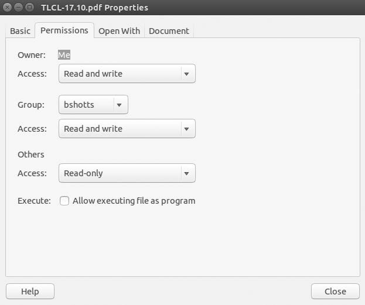
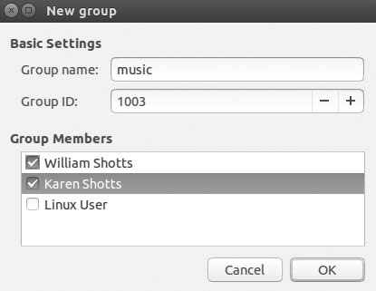

# <p style="text-align:center;color:red">9</p>
# <p style="text-align:center;color:red">permissions<br /><span style="color:brown">Permisos</span></p>

Operating systems in the Unix tradition differ from those in the MS-DOS tradition in that they are not only multitasking systems but also multiuser systems.<br /><span style="color:brown">Los sistemas operativos de la tradición Unix difieren de los de la tradición MS-DOS en que no son solo sistemas multitarea, sino también sistemas multiusuario.</span>

What exactly does this mean? It means that more than one person can be using the computer at the same time. While a typical computer will likely have only one keyboard and monitor, it can still be used by more than one user. For example, if a computer is attached to a network or the Internet, remote users can log in via ssh (secure shell) and operate the computer. In fact, remote users can execute graphical applications and have the graphical output appear on a remote display. The X Window System supports this as part of its basic design.<br /><span style="color:brown">¿Qué significa esto exactamente? Significa que más de una persona puede usar la computadora al mismo tiempo. Si bien es probable que una computadora típica solo tenga un teclado y un monitor, aún puede ser utilizada por más de un usuario. Por ejemplo, si una computadora está conectada a una red o Internet, los usuarios remotos pueden iniciar sesión a través de ssh (shell seguro) y operar la computadora. De hecho, los usuarios remotos pueden ejecutar aplicaciones gráficas y hacer que la salida gráfica aparezca en una pantalla remota. El sistema X Window admite esto como parte de su diseño básico.</span>

The multiuser capability of Linux is not a recent “innovation” but rather a feature that is deeply embedded into the design of the operating system.<br /><span style="color:brown">La capacidad multiusuario de Linux no es una “innovación” reciente, sino más bien una característica que está profundamente arraigada en el diseño del sistema operativo.</span>

Considering the environment in which Unix was created, this makes perfect sense. Years ago, before computers were “personal,” they were large, expensive, and centralized. A typical university computer system, for example, consisted of a large central computer located in one building and terminals that were located throughout the campus, each connected to the large central computer. The computer would support many users at the same time.<br /><span style="color:brown">Teniendo en cuenta el entorno en el que se creó Unix, esto tiene mucho sentido. Hace años, antes de que las computadoras fueran "personales", eran grandes, costosas y centralizadas. Un sistema informático universitario típico, por ejemplo, consistía en una gran computadora central ubicada en un edificio y terminales que estaban ubicadas en todo el campus, cada una conectada a la gran computadora central. La computadora admitiría muchos usuarios al mismo tiempo.</span>

To make this practical, a method had to be devised to protect the users from each other. After all, the actions of one user could not be allowed to crash the computer, nor could one user interfere with the files belonging to another user.<br /><span style="color:brown">Para que esto sea práctico, se tuvo que idear un método para proteger a los usuarios entre sí. Después de todo, no se puede permitir que las acciones de un usuario bloqueen la computadora, ni un usuario podría interferir con los archivos que pertenecen a otro usuario.</span>

In this chapter, we will look at this essential part of system security and introduce the following commands:<br /><span style="color:brown">En este capítulo, veremos esta parte esencial de la seguridad del sistema e introduciremos los siguientes comandos:</span>

* id -- Display user identity<br /><span style="color:brown">id -- muestra la identidad del usuario</span>

* chmod -- Change a file’s mode<br /><span style="color:brown">chmod -- cambia el modo de un archivo</span>

* umask -- Set the default file permissions<br /><span style="color:brown">umask -- establece los permisos de archivo predeterminados</span>

* su -- Run a shell as another user<br /><span style="color:brown">su -- Ejecutar un shell como otro usuario</span>

* sudo -- Execute a command as another user<br /><span style="color:brown">Sudo - Ejecutar un comando como otro usuario</span>

* chown -- Change a file’s owner<br /><span style="color:brown">chown -- cambiar el propietario de un archivo</span>

* chgrp -- Change a file’s group ownership<br /><span style="color:brown">chgrp -- cambiar la propiedad del grupo de un archivo</span>

* passwd -- Change a user’s password<br /><span style="color:brown">passwd -- cambiar la contraseña de un usuario</span>

# Owners, Group Members, and Everybody Else<br /><span style="color:yellow">Propietarios, miembros del grupo y todos los demás</span>

When we were exploring the system in Chapter 3, we may have encountered a problem when trying to examine a file such as /etc/shadow.<br /><span style="color:brown">Cuando estábamos explorando el sistema en el Capítulo 3, es posible que hayamos encontrado un problema al intentar examinar un archivo como / etc / shadow.</span>

```bash
[me@linuxbox~]$ file /etc/shadow
/etc/shadow: regular file, no read permission
[me@linuxbox~]$ less /etc/shadow
/etc/shadow: Permission denied
```

The reason for this error message is that, as regular users, we do not have permission to read this file.<br /><span style="color:brown">El motivo de este mensaje de error es que, como usuarios habituales, no tenemos permiso para leer este archivo.</span>

In the Unix security model, a user may own files and directories. When a user owns a file or directory, the user has control over its access. Users can, in turn, belong to a group consisting of one or more users who are given access to files and directories by their owners. In addition to granting access to a group, an owner may also grant some set of access rights to everybody, which in Unix terms is referred to as the world. To find out information about your identity, use the id command.<br /><span style="color:brown">En el modelo de seguridad de Unix, un usuario puede poseer archivos y directorios. Cuando un usuario posee un archivo o directorio, el usuario tiene control sobre su acceso. Los usuarios pueden, a su vez, pertenecer a un grupo formado por uno o más usuarios a los que sus propietarios les dan acceso a archivos y directorios. Además de otorgar acceso a un grupo, un propietario también puede otorgar un conjunto de derechos de acceso a todos, lo que en términos de Unix se conoce como el mundo. Para obtener información sobre su identidad, utilice el comando id.</span>

```bash
[me@linuxbox ~]$ id
uid=500(me) gid=500(me) groups=500(me)
```

Let’s look at the output. When user accounts are created, users are assigned a number called a user ID (uid), which is then, for the sake of the humans, mapped to a username. The user is assigned a group ID (gid) and may belong to additional groups. The preceding example is from a Fedora system. On other systems, such as Ubuntu, the output may look a little different.<br /><span style="color:brown">Veamos el resultado. Cuando se crean las cuentas de usuario, a los usuarios se les asigna un número llamado ID de usuario (uid), que luego, por el bien de los humanos, se asigna a un nombre de usuario. Al usuario se le asigna un ID de grupo (gid) y puede pertenecer a grupos adicionales. El ejemplo anterior es de un sistema Fedora. En otros sistemas, como Ubuntu, la salida puede verse un poco diferente.</span>

```
[me@linuxbox ~]$ id
uid=1000(me) gid=1000(me) groups=4(adm),20(dialout),24(cdrom),25(floppy),
29(audio),30(dip),44(video),46(plugdev),108(lpadmin),114(admin),1000(me)
```

As we can see, the uid and gid numbers are different in Ubuntu. This is simply because Fedora starts its numbering of regular user accounts at 500, while Ubuntu starts at 1,000. We can also see that the Ubuntu user belongs to a lot more groups. This has to do with the way Ubuntu manages privileges for system devices and services.<br /><span style="color:brown">Como podemos ver, los números de uid y gid son diferentes en Ubuntu. Esto se debe simplemente a que Fedora comienza su numeración de cuentas de usuario regulares en 500, mientras que Ubuntu comienza en 1,000. También podemos ver que el usuario de Ubuntu pertenece a muchos más grupos. Esto tiene que ver con la forma en que Ubuntu administra los privilegios para los dispositivos y servicios del sistema.</span>

So, where does this information come from? Like so many things in Linux, it comes from a couple of text files. User accounts are defined in the /etc/passwd file, and groups are defined in the /etc/group file. When user accounts and groups are created, these files are modified along with etc/shadow, which holds information about the user’s password. For each user account, the /etc/passwd file defines the user (login) name, uid, gid, account’s real name, home directory, and login shell. If we examine the contents of /etc/passwd and /etc/group, we notice that besides the regular user accounts, there are accounts for the superuser (uid 0) and various other system users.<br /><span style="color:brown">Entonces, ¿de dónde viene esta información? Como tantas cosas en Linux, proviene de un par de archivos de texto. Las cuentas de usuario se definen en el archivo / etc / passwd y los grupos se definen en el archivo / etc / group. Cuando se crean cuentas de usuario y grupos, estos archivos se modifican junto con etc / shadow, que contiene información sobre la contraseña del usuario. Para cada cuenta de usuario, el archivo / etc / passwd define el nombre de usuario (inicio de sesión), uid, gid, el nombre real de la cuenta, el directorio de inicio y el shell de inicio de sesión. Si examinamos el contenido de / etc / passwd y / etc / group, notamos que además de las cuentas de usuario normales, hay cuentas para el superusuario (uid 0) y varios otros usuarios del sistema.</span>

In the next chapter, when we cover processes, we will see that some of these other “users” are, in fact, quite busy.<br /><span style="color:brown">En el próximo capítulo, cuando cubramos procesos, veremos que algunos de estos otros "usuarios" están, de hecho, bastante ocupados.</span>

While many Unix-like systems assign regular users to a common group such as users , modern Linux practice is to create a unique, single-member group with the same name as the user. This makes certain types of permission assignment easier.<br /><span style="color:brown">Si bien muchos sistemas similares a Unix asignan usuarios regulares a un grupo común como los usuarios, la práctica moderna de Linux es crear un grupo único de un solo miembro con el mismo nombre que el usuario. Esto facilita ciertos tipos de asignación de permisos.</span>

# Reading, Writing, and Executing<br /><span style="color:brown">Leer, escribir y ejecutar</span>

Access rights to files and directories are defined in terms of read access, write access, and execution access. If we look at the output of the ls command, we can get some clue as to how this is implemented.<br /><span style="color:brown">Los derechos de acceso a archivos y directorios se definen en términos de acceso de lectura, acceso de escritura y acceso de ejecución. Si miramos la salida del comando ls, podemos obtener alguna pista sobre cómo se implementa.</span>

```
[me@linuxbox ~]$ > foo.txt
[me@linuxbox ~]$ ls -l foo.txt
-rw-rw-r-- 1 me  me  0 2018-03-06 14:52 foo.txt
```

The first 10 characters of the listing are the file attributes. The first of these characters is the file type. Table 9-1 describes the file types you are most likely to see (there are other, less common types too).<br /><span style="color:brown">Los primeros 10 caracteres de la lista son los atributos del archivo. El primero de estos caracteres es el tipo de archivo. La Tabla 9-1 describe los tipos de archivo que es más probable que vea (también hay otros tipos menos comunes).</span>

> Table 9-1: File Types<br /><span style="color:brown">Tabla 9-1: Tipos de archivo</span>

| Attribute | File type |
|-----------|------------|
| - | A regular file.<br /><span style="color:brown">Un archivo normal.</span> |
| d | A directory. <br /><span style="color:brown">Un directorio</span>|
| l | A symbolic link. Notice that with symbolic links, the remaining file attributes are always rwxrwxrwx and are dummy values. The real file attributes are those of the file the symbolic link points to.<br /><span style="color:brown">Un vínculo simbólico. Observe que con enlaces simbólicos, los atributos de archivo restantes son siempre rwxrwxrwx y son valores ficticios. Los atributos del archivo real son los del archivo al que apunta el enlace simbólico.</span>|
| c | A character special file. This file type refers to a device that handles data as a stream of bytes, such as a terminal or /dev/null.<br /><span style="color:brown">Un archivo especial de caracteres. Este tipo de archivo se refiere a un dispositivo que maneja datos como un flujo de bytes, como un terminal o /dev/null.</span> |
| b | A block special file. This file type refers to a device that handles data in blocks, such as a hard drive or DVD drive.<br /><span style="color:brown">Un archivo especial de bloque. Este tipo de archivo se refiere a un dispositivo que maneja datos en bloques, como un disco duro o una unidad de DVD.</span> |

___

The remaining nine characters of the file attributes, called the file mode, represent the read, write, and execute permissions for the file’s owner, the file’s group owner, and everybody else.<br /><span style="color:brown">Los nueve caracteres restantes de los atributos del archivo, denominados modo de archivo, representan los permisos de lectura, escritura y ejecución del propietario del archivo, el propietario del grupo del archivo y todos los demás.</span>

| Owner<br /><span style="color:brown">Dueño</span> | Group<br /><span style="color:brown">Grupo</span> | World<br /><span style="color:brown">Mundo</span> |
|-------|-------|-------|
| rwx  | rwx  | rwx |

_____

Table 9-2 documents the effect that r , w , and x mode attributes have when set on files and directories.<br /><span style="color:brown">La Tabla 9-2 documenta el efecto que tienen los atributos de modo r, wyx cuando se configuran en archivos y directorios.</span>

> Table 9-2: Permission Attributes<br /><span style="color:brown">Tabla 9-2: Atributos de permisos</span>

| Attribute<br /><span style="color:brown">Atributo</span> | Files<br /><span style="color:brown">Archivos</span> |  Directories<br /><span style="color:brown">Directorios</span> |
|-----------|-------|--------------|
| r | Allows a file to be opened and read.<br /><span style="color:brown">Permite abrir y leer un archivo.</span> | Allows a directory’s contents to be listed if the execute attribute is also set.<br /><span style="color:brown">Permite que se enumere el contenido de un directorio si también se establece el atributo de ejecución.</span> |
| w | Allows a file to be written to or truncated; however, this attribute does not allow files to be renamed or deleted. The ability to delete or rename files is determined by directory attributes.<br /><span style="color:brown">Permite escribir o truncar un archivo; sin embargo, este atributo no permite cambiar el nombre de los archivos ni eliminarlos. La capacidad de eliminar o cambiar el nombre de los archivos está determinada por los atributos del directorio.</span> | Allows files within a directory to be created, deleted, and renamed if the execute attribute is also set.<br /><span style="color:brown">Permite que los archivos dentro de un directorio se creen, eliminen y renombren si el atributo de ejecución también está establecido.</span> |
| x | Allows a file to be treated as a program and executed. Program files written in scripting languages must also be set as readable to be executed. <br /><span style="color:brown">Permite que un archivo sea tratado como un programa y ejecutado. Los archivos de programa escritos en lenguajes de secuencias de comandos también deben configurarse como legibles para su ejecución.</span>| Allows a directory to be entered, e.g., cd directory.<br /><span style="color:brown">Permite ingresar a un directorio, por ejemplo, directorio de cd.</span> |

_______

Table 9-3 provides some examples of file attribute settings.<br /><span style="color:brown">La Tabla 9-3 proporciona algunos ejemplos de configuración de atributos de archivo.</span>

> Table 9-3: Permission Attribute Examples<br /><span style="color:brown">Tabla 9-3: Ejemplos de atributos de permisos</span>

| File Attributes<br /><span style="color:brown">Atributos de archivo</span> | Meaning<br /><span style="color:brown">Significado</span> |
|-----------------|-----------------|
| -rwx------ | A regular file that is readable, writable, and executable by the file’s owner. No one else has any access.<br /><span style="color:brown">Un archivo normal que el propietario del archivo puede leer, escribir y ejecutar. Nadie más tiene acceso.</span> |
| -rw------- | A regular file that is readable and writable by the file’s owner. No one else has any access.<br /><span style="color:brown">Un archivo normal que el propietario del archivo puede leer y escribir. Nadie más tiene acceso.</span> |
| -rw-r--r-- | A regular file that is readable and writable by the file’s owner. Members of the file’s owner group may read the file. The file is world-readable.<br /><span style="color:brown">Un archivo normal que el propietario del archivo puede leer y escribir. Los miembros del grupo de propietarios del archivo pueden leerlo. El archivo se puede leer en todo el mundo.</span> |
| -rwxr-xr-x  | A regular file that is readable, writable, and executable by the file’s owner. The file may be read and executed by everybody else.<br /><span style="color:brown">Un archivo normal que el propietario del archivo puede leer, escribir y ejecutar. El archivo puede ser leído y ejecutado por todos los demás.</span> |
| -rw-rw---- | A regular file that is readable and writable by the file’s owner and members of the file’s group owner only.<br /><span style="color:brown">Un archivo normal que solo pueden leer y escribir el propietario del archivo y los miembros del propietario del grupo del archivo.</span> |
| lrwxrwxrwx | A symbolic link. All symbolic links have “dummy” permissions. The real permissions are kept with the actual file pointed to by the symbolic link.<br /><span style="color:brown">Un vínculo simbólico. Todos los enlaces simbólicos tienen permisos "ficticios". Los permisos reales se mantienen con el archivo real al que apunta el enlace simbólico.</span> |
| drwxrwx--- | A directory. The owner and the members of the owner group may1 enter the directory and create, rename, and remove files within the directory.<br /><span style="color:brown">Un directorio. El propietario y los miembros del grupo de propietarios pueden1 ingresar al directorio y crear, renombrar y eliminar archivos dentro del directorio.</span> |
| drwxr-x--- | A directory. The owner may enter the directory and create, rename, and delete files within the directory. Members of the owner group may enter the directory but cannot create, delete, or rename files.<br /><span style="color:brown">Un directorio. El propietario puede ingresar al directorio y crear, renombrar y eliminar archivos dentro del directorio. Los miembros del grupo de propietarios pueden ingresar al directorio, pero no pueden crear, eliminar ni cambiar el nombre de los archivos.</span> |

____

# chmod --> Change File Mode<br /><span style="color:yellow">chmod --> Cambiar modo de archivo</span>

To change the mode (permissions) of a file or directory, use the chmod command. Be aware that only the file’s owner or the superuser can change the mode of a file or directory. chmod supports two distinct ways of specifying mode changes.<br /><span style="color:brown">Para cambiar el modo (permisos) de un archivo o directorio, use el comando chmod. Tenga en cuenta que solo el propietario del archivo o el superusuario pueden cambiar el modo de un archivo o directorio. chmod admite dos formas distintas de especificar cambios de modo</span>

* Octal number representation<br /><span style="color:brown">Representación del número octal</span>

* Symbolic representation<br /><span style="color:brown">Representación simbólica</span>

We will cover octal number representation first. With octal notation, we use octal numbers to set the pattern of desired permissions. Because each digit in an octal number represents three binary digits, this maps nicely to the scheme used to store the file mode. Table 9-4 shows what we mean.<br /><span style="color:brown">Primero cubriremos la representación del número octal. Con la notación octal, usamos números octales para establecer el patrón de permisos deseados. Debido a que cada dígito de un número octal representa tres dígitos binarios, esto se relaciona muy bien con el esquema utilizado para almacenar el modo de archivo. La tabla 9-4 muestra lo que queremos decir.</span>

_______

> # What the Heck Is Octal?<br /><span style="color:brown">¿Qué diablos es Octal?</span>

> Octal (base 8) and its cousin, hexadecimal (base 16), are number systems often used to express numbers on computers. We humans, owing to the fact that we (or at least most of us) were born with 10 fingers, count using a base 10 number system. Computers, on the other hand, were born with only one finger and thus do all their counting in binary (base 2). Their number system has only two numerals, 0 and 1. So, in binary, counting looks like this:<br /><span style="color:brown">Octal (base 8) y su primo, hexadecimal (base 16), son sistemas numéricos que se utilizan a menudo para expresar números en computadoras. Nosotros, los humanos, debido al hecho de que nosotros (o al menos la mayoría de nosotros) nacimos con 10 dedos, contamos usando un sistema numérico de base 10. Las computadoras, por otro lado, nacieron con un solo dedo y, por lo tanto, hacen todo su conteo en binario (base 2). Su sistema numérico tiene solo dos números, 0 y 1. Entonces, en binario, el conteo se ve así:</span>

> `0, 1, 10, 11, 100, 101, 110, 111, 1000, 1001, 1010, 1011. . .`

> In octal, counting is done with the numerals zero through seven, like so:<br /><span style="color:brown">En octal, el conteo se realiza con los números del cero al siete, así:</span>

> `0, 1, 2, 3, 4, 5, 6, 7, 10, 11, 12, 13, 14, 15, 16, 17, 20, 21. . .`

> Hexadecimal counting uses the numerals zero through nine plus the letters A through F.<br /><span style="color:brown">El conteo hexadecimal usa los números del cero al nueve más las letras de la A a la F.</span>

> `0, 1, 2, 3, 4, 5, 6, 7, 8, 9, A, B, C, D, E, F, 10, 11, 12, 13. . .`

> While we can see the sense in binary (since computers have only one finger), what are octal and hexadecimal good for? The answer has to do with human convenience. Many times, small portions of data are represented on computers as bit patterns. Take, for example, an RGB color. On most computer displays, each pixel is composed of three color components: eight bits of red, eight bits of green, and eight bits of blue. A lovely medium blue would be a 24-digit number.<br /><span style="color:brown">Si bien podemos ver el sentido en binario (dado que las computadoras solo tienen un dedo), ¿para qué sirven octal y hexadecimal? La respuesta tiene que ver con la conveniencia humana. Muchas veces, pequeñas porciones de datos se representan en las computadoras como patrones de bits. Tomemos, por ejemplo, un color RGB. En la mayoría de las pantallas de computadora, cada píxel está compuesto por tres componentes de color: ocho bits de rojo, ocho bits de verde y ocho bits de azul. Un hermoso azul medio sería un número de 24 dígitos.</span>

> `010000110110111111001101`

> How would you like to read and write those kinds of numbers all day? I didn’t think so. Here’s where another number system would help. Each digit in a hexadecimal number represents four digits in binary. In octal, each digit represents three binary digits. So, our 24-digit medium blue could be condensed to a six-digit hexadecimal number, 436FCD.<br /><span style="color:brown">¿Cómo le gustaría leer y escribir ese tipo de números todo el día? No lo creo. Aquí es donde ayudaría otro sistema numérico. Cada dígito de un número hexadecimal representa cuatro dígitos en binario. En octal, cada dígito representa tres dígitos binarios. Entonces, nuestro azul medio de 24 dígitos podría condensarse en un número hexadecimal de seis dígitos, 436FCD.</span>

> Because the digits in the hexadecimal number “line up” with the bits in the binary number, we can see that the red component of our color is 43, the green 6F, and the blue CD.<br /><span style="color:brown">Debido a que los dígitos del número hexadecimal "se alinean" con los bits del número binario, podemos ver que el componente rojo de nuestro color es 43, el verde 6F y el azul CD.</span>

> These days, hexadecimal notation (often spoken as hex) is more common than octal, but as we will soon see, octal’s capability to express three bits of binary will be very useful . . .<br /><span style="color:brown">En estos días, la notación hexadecimal (a menudo hablada como hexadecimal) es más común que la octal, pero como veremos pronto, la capacidad de octal para expresar tres bits binarios será muy útil. . .</span>

__________

> Table 9-4: File Modes in Binary and Octal<br /><span style="color:brown">Tabla 9-4: Modos de archivo en binario y octal</span>

| Octal | Binary | File mode |
|-------|--------|-----------|
| 0 | 000 | --- |
| 1 | 001 | --x |
| 2 | 010 | -w- |
| 3 | 011 | -wx |
| 4 | 100 | r-- |
| 5 | 101 | r-x |
| 6 | 110 | rw- |
| 7 | 111 | rwx |

__________

By using three octal digits, we can set the file mode for the owner, group owner, and world.<br /><span style="color:brown">Al usar tres dígitos octales, podemos configurar el modo de archivo para el propietario, el propietario del grupo y el mundo.</span>

```
[me@linuxbox~]$ > foo.txt
[me@linuxbox~]$ ls -l foo.txt
-rw-rw-r-- 1 me me 0 2018-03-06 14:52 foo.txt
[me@linuxbox ~]$ chmod 600 foo.txt
[me@linuxbox ~]$ ls -l foo.txt
-rw------- 1 me me 0 2018-03-06 14:52 foo.txt
```

By passing the argument 600 , we were able to set the permissions of the owner to read and write while removing all permissions from the group owner and world. Though remembering the octal to binary mapping may seem inconvenient, you will usually have to use only a few common ones:<br /><span style="color:brown">Al pasar el argumento 600, pudimos establecer los permisos del propietario para leer y escribir mientras eliminamos todos los permisos del propietario del grupo y del mundo. Aunque recordar el mapeo octal a binario puede parecer un inconveniente, por lo general tendrá que usar solo algunos comunes:</span>

`7 ( rwx ), 6 ( rw- ), 5 ( r-x ), 4 ( r-- ), and 0 ( --- ).`

chmod also supports a symbolic notation for specifying file modes.<br /><span style="color:brown">chmod también admite una notación simbólica para especificar modos de archivo.</span>

Symbolic notation is divided into three parts.<br /><span style="color:brown">La notación simbólica se divide en tres partes.</span>


* Who the change will affect<br /><span style="color:brown">A quién afectará el cambio</span>

* Which operation will be performed<br /><span style="color:brown">Qué operación se realizará</span>

* What permission will be set<br /><span style="color:brown">What permission will be set</span>

To specify who is affected, a combination of the characters u , g , o , and a is used, as shown in Table 9-5.<br /><span style="color:brown">Para especificar quién se ve afectado, se utiliza una combinación de los caracteres u, g, o y a, como se muestra en la tabla 9-5.</span>

> Table 9-5: chmod Symbolic Notation<br /><span style="color:brown">Tabla 9-5: Notación simbólica chmod</span>

| Symbol | Meaning |
|--------|---------|
| u | Short for “user” but means the file or directory owner.<br /><span style="color:brown">Abreviatura de "usuario", pero significa el propietario del archivo o directorio.</span>| 
| g | Group owner.<br /><span style="color:brown">Propietario del grupo.</span>|
| o | Short for “others” but means world.<br /><span style="color:brown">Abreviatura de "otros" pero significa mundo.</span>|
| a | Short for “all.” This is a combination of u , g , and o.<br /><span style="color:brown">Abreviatura de "todos". Esta es una combinación de u, gyo.</span>|

____

If no character is specified, “all” will be assumed. The operation may be a + indicating that a permission is to be added, a - indicating that a permission is to be taken away, or a = indicating that only the specified permissions are to be applied and that all others are to be removed.<br /><span style="color:brown">Si no se especifica ningún carácter, se asumirá "todos". La operación puede ser un + que indica que se debe agregar un permiso, un - que indica que se debe quitar un permiso, o un = que indica que solo se aplicarán los permisos especificados y que todos los demás se eliminarán.</span>

Permissions are specified with the r , w , and x characters. Table 9-6 provides some examples of symbolic notation.<br /><span style="color:brown">Los permisos se especifican con los caracteres r, w y x. La tabla 9-6 proporciona algunos ejemplos de notación simbólica.</span>

> Table 9-6: chmod Symbolic Notation Examples<br /><span style="color:brown">Tabla 9-6: Ejemplos de notación simbólica chmod</span>

| Notation |  Meaning |
|----------|-----------|
| u+x | Add execute permission for the owner.<br /><span style="color:brown">Agregar permiso de ejecución para el propietario</span>|
| u-x | Remove execute permission from the owner.<br /><span style="color:brown">Eliminar el permiso de ejecución del propietario.</span>|
| +x  | Add execute permission for the owner, group, and world. This is equivalent to a+x.<br /><span style="color:brown">Agregue permiso de ejecución para el propietario, el grupo y el mundo. Esto es equivalente a a + x.</span>|
| o-rw | Remove the read and write permissions from anyone besides the owner and group owner.<br /><span style="color:brown">Elimine los permisos de lectura y escritura de cualquier persona que no sea el propietario y el propietario del grupo.</span>|
| go=rw | Set the group owner and anyone besides the owner to have read and write permissions. If either the group owner or the world previously had execute permission, it is removed.<br /><span style="color:brown">Configure el propietario del grupo y cualquier persona además del propietario para que tenga permisos de lectura y escritura. Si el propietario del grupo o el mundo anteriormente tenían permiso de ejecución, se elimina.</span>| 
| u+x,go=rx | Add execute permission for the owner and set the permissions for the group and others to read and execute. Multiple specifications may be separated by commas.<br /><span style="color:brown">Agregue permiso de ejecución para el propietario y establezca los permisos para que el grupo y otros lean y ejecuten. Varias especificaciones pueden estar separadas por comas.</span>| 

____

Some people prefer to use octal notation, and some folks really like the symbolic. Symbolic notation does offer the advantage of allowing you to set a single attribute without disturbing any of the others.<br /><span style="color:brown">Algunas personas prefieren usar la notación octal, y a algunas personas les gusta mucho lo simbólico. La notación simbólica ofrece la ventaja de permitirle establecer un solo atributo sin molestar a ninguno de los demás.</span>

Take a look at the chmod man page for more details and a list of options.<br /><span style="color:brown">Eche un vistazo a la página de manual de chmod para obtener más detalles y una lista de opciones.</span>

A word of caution regarding the --recursive option: it acts on both files and directories, so it’s not as useful as we would hope because we rarely want files and directories to have the same permissions.<br /><span style="color:brown">Una advertencia con respecto a la opción --recursive: actúa tanto en archivos como en directorios, por lo que no es tan útil como esperaríamos porque rara vez queremos que los archivos y directorios tengan los mismos permisos.</span>

# Setting File Mode with the GUI<br /><span style="color:brown">Configuración del modo de archivo con la GUI</span>

Now that we have seen how the permissions on files and directories are set, we can better understand the permission dialogs in the GUI. In both Files (GNOME) and Dolphin (KDE), right-clicking a file or directory icon will expose a properties dialog. Figure 9-1 provides an example from GNOME. Here we can see the settings for the owner, group, and world.<br /><span style="color:brown">Ahora que hemos visto cómo se establecen los permisos en archivos y directorios, podemos comprender mejor los diálogos de permisos en la GUI. Tanto en Archivos (GNOME) como en Dolphin (KDE), al hacer clic con el botón derecho en el icono de un archivo o directorio se mostrará un cuadro de diálogo de propiedades. La Figura 9-1 proporciona un ejemplo de GNOME. Aquí podemos ver la configuración del propietario, el grupo y el mundo.</span>


{ Figure 9-1: GNOME file permissions dialog<br /><span style="color:brown">Figura 9-1: cuadro de diálogo de permisos de archivo GNOME</span> }

# umask --> Set Default Permissions<br /><span style="color:yellow">umask --> establecer permisos predeterminados</span>

The umask command controls the default permissions given to a file when it is created. It uses octal notation to express a mask of bits to be removed from a file’s mode attributes. Let’s take a look.<br /><span style="color:brown">El comando umask controla los permisos predeterminados otorgados a un archivo cuando se crea. Utiliza la notación octal para expresar una máscara de bits que se eliminarán de los atributos de modo de un archivo. Vamos a ver.</span>

```
[me@linuxbox~]$ rm -f foo.txt
[me@linuxbox~]$ > foo.txt
0002
[me@linuxbox~]$ umask
[me@linuxbox~]$ ls -l foo.txt
-rw-rw-r-- 1    me  me  0 2018-03-06 14:53 foo.txt
```
We first removed any old copy of foo.txt to make sure we were starting fresh. Next, we ran the umask command without an argument to see the current value. It responded with the value 0002 (the value 0022 is another common default value), which is the octal representation of our mask. We next create a new instance of the file foo.txt and observe its permissions.<br /><span style="color:brown">Primero eliminamos cualquier copia antigua de foo.txt para asegurarnos de que comenzamos de nuevo. A continuación, ejecutamos el comando umask sin un argumento para ver el valor actual. Respondió con el valor 0002 (el valor 0022 es otro valor predeterminado común), que es la representación octal de nuestra máscara. A continuación, creamos una nueva instancia del archivo foo.txt y observamos sus permisos.</span>

We can see that both the owner and group get read and write permission, while everyone else gets only read permission. The reason that world does not have write permission is because of the value of the mask. Let’s repeat our example, this time setting the mask ourselves.<br /><span style="color:brown">Podemos ver que tanto el propietario como el grupo obtienen permiso de lectura y escritura, mientras que todos los demás solo obtienen permiso de lectura. La razón por la que world no tiene permiso de escritura es por el valor de la máscara. Repitamos nuestro ejemplo, esta vez colocando la máscara nosotros mismos.</span>

```
[me@linuxbox~]$ rm foo.txt
[me@linuxbox~]$ umask 0000
[me@linuxbox~]$ > foo.txt
[me@linuxbox~]$ ls -l foo.txt
-rw-rw-rw- 1 me me 0 2018-03-06 14:58 foo.txt
```

When we set the mask to 0000 (effectively turning it off), we see that the file is now world writable. To understand how this works, we have to look at octal numbers again. If we take the mask, expand it into binary, and then compare it to the attributes, we can see what happens.<br /><span style="color:brown">Cuando configuramos la máscara en 0000 (efectivamente desactivándola), vemos que el archivo ahora es de escritura mundial. Para entender cómo funciona esto, tenemos que mirar nuevamente los números octales. Si tomamos la máscara, la expandimos a binario y luego la comparamos con los atributos, podemos ver qué sucede.</span>

| Original file mode | --- rw- rw- rw- |
|-------------------|------------------|
| Mask | 000 000 000 010 |
| Result | --- rw- rw- r-- |


Ignore for the moment the leading zeros (we’ll get to those in a minute) and observe that where the 1 appears in our mask, an attribute was removed — in this case, the world write permission. That’s what the mask does. Everywhere a 1 appears in the binary value of the mask, an attribute is unset. If we look at a mask value of 0022 , we can see what it does.<br /><span style="color:brown">Ignore por el momento los ceros iniciales (llegaremos a esos en un minuto) y observe que donde aparece el 1 en nuestra máscara, se eliminó un atributo; en este caso, el permiso de escritura mundial. Eso es lo que hace la máscara. Dondequiera que aparezca un 1 en el valor binario de la máscara, un atributo está desarmado. Si miramos un valor de máscara de 0022, podemos ver lo que hace.</span>

| Original file mode | --- rw- rw- rw- |
|--------------------|------------------|
| Mask | 000 000 010 010 |
| Result | --- rw- r-- r-- |

_______

Again, where a 1 appears in the binary value, the corresponding attribute is unset. Play with some values (try some sevens) to get used to how this works. When you’re done, remember to clean up.<br /><span style="color:brown">Nuevamente, cuando aparece un 1 en el valor binario, el atributo correspondiente no se establece. Juega con algunos valores (prueba con algunos sietes) para acostumbrarte a cómo funciona. Cuando haya terminado, recuerde limpiar.</span>

`[me@linuxbox ~]$ rm foo.txt; umask 0002`

Most of the time we won’t have to change the mask; the default provided by your distribution will be fine. In some high-security situations, however, we will want to control it.<br /><span style="color:brown">La mayoría de las veces no tendremos que cambiar la máscara; el valor predeterminado proporcionado por su distribución estará bien. En algunas situaciones de alta seguridad, sin embargo, querremos controlarlo.</span>

# Some Special Permissions<br /><span style="color:yellow">Algunos permisos especiales</span>

Though we usually see an octal permission mask expressed as a threedigit number, it is more technically correct to express it in four digits.<br /><span style="color:brown">Aunque normalmente vemos una máscara de permiso octal expresada como un número de tres dígitos, es técnicamente más correcto expresarla en cuatro dígitos.</span>

Why? Because, in addition to read, write, and execute permissions, there are some other, less used, permissions settings.<br /><span style="color:brown">¿Por qué? Porque, además de los permisos de lectura, escritura y ejecución, existen otras configuraciones de permisos menos utilizadas.</span>

The first of these is the setuid bit (octal 4000). When applied to an executable file, it changes the effective user ID from that of the real user (the user actually running the program) to that of the program’s owner.<br /><span style="color:brown">El primero de ellos es el bit setuid (octal 4000). Cuando se aplica a un archivo ejecutable, cambia la ID de usuario efectiva de la del usuario real (el usuario que realmente ejecuta el programa) a la del propietario del programa.</span>

Most often this is given to a few programs owned by the superuser. When an ordinary user runs a program that is setuid root, the program runs with the effective privileges of the superuser. This allows the program to access files and directories that an ordinary user would normally be prohibited from accessing. Clearly, because this raises security concerns, the number of setuid programs must be held to an absolute minimum.<br /><span style="color:brown">La mayoría de las veces, esto se da a algunos programas propiedad del superusuario. Cuando un usuario común ejecuta un programa que es root, el programa se ejecuta con los privilegios efectivos del superusuario. Esto permite que el programa acceda a archivos y directorios a los que normalmente no podría acceder un usuario normal. Claramente, debido a que esto genera preocupaciones de seguridad, el número de programas setuid debe mantenerse en un mínimo absoluto.</span>

The second less-used setting is the setgid bit (octal 2000), which, like the setuid bit, changes the effective group ID from the real group ID of the real user to that of the file owner. If the setgid bit is set on a directory, newly created files in the directory will be given the group ownership of the directory rather the group ownership of the file’s creator. This is useful in a shared directory when members of a common group need access to all the files in the directory, regardless of the file owner’s primary group.<br /><span style="color:brown">El segundo ajuste menos utilizado es el bit setgid (octal 2000), que, como el bit setuid, cambia la ID de grupo efectiva de la ID de grupo real del usuario real a la del propietario del archivo. Si el bit setgid se establece en un directorio, los archivos recién creados en el directorio recibirán la propiedad grupal del directorio en lugar de la propiedad grupal del creador del archivo. Esto es útil en un directorio compartido cuando los miembros de un grupo común necesitan acceder a todos los archivos del directorio, independientemente del grupo principal del propietario del archivo.</span>

The third is called the sticky bit (octal 1000). This is a holdover from ancient Unix, where it was possible to mark an executable file as “not swappable.” On files, Linux ignores the sticky bit, but if applied to a directory, it prevents users from deleting or renaming files unless the user is either the owner of the directory, the owner of the file, or the superuser.<br /><span style="color:brown">El tercero se llama bit pegajoso (octal 1000). Este es un vestigio de la antigua Unix, donde era posible marcar un archivo ejecutable como "no intercambiable". En los archivos, Linux ignora el bit pegajoso, pero si se aplica a un directorio, evita que los usuarios eliminen o cambien el nombre de los archivos a menos que el usuario sea el propietario del directorio, el propietario del archivo o el superusuario.</span>

This is often used to control access to a shared directory, such as /tmp. <br /><span style="color:brown">Esto se usa a menudo para controlar el acceso a un directorio compartido, como /tmp.</span>

Here are some examples of using chmod with symbolic notation to set these special permissions. First, here’s an example of assigning setuid to a program:<br /><span style="color:brown">Aquí hay algunos ejemplos del uso de chmod con notación simbólica para establecer estos permisos especiales. Primero, aquí hay un ejemplo de asignación de setuid a un programa:</span>

`chmod u+s program`

Next, here’s an example of assigning setgid to a directory:<br /><span style="color:brown">A continuación, aquí hay un ejemplo de cómo asignar setgid a un directorio:</span>

`chmod g+s dir`

Finally, here’s an example of assigning the sticky bit to a directory:<br /><span style="color:brown">Finalmente, aquí hay un ejemplo de cómo asignar el bit adhesivo a un directorio:</span>

`chmod +t dir`

When viewing the output from ls , you can determine the special permissions. Here are some examples. First, an example of a program that is setuid:<br /><span style="color:brown">Al ver la salida de ls, puede determinar los permisos especiales. Aquí hay unos ejemplos. Primero, un ejemplo de un programa que es setuid:</span>

`-rwsr-xr-x`

Here’s an example of a directory that has the setgid attribute:<br /><span style="color:brown">A continuación, se muestra un ejemplo de un directorio que tiene el atributo setgid:</span>

`drwxrwsr-x`

Here’s an example of a directory with the sticky bit set:<br /><span style="color:brown">A continuación, se muestra un ejemplo de un directorio con el bit adhesivo establecido:</span>

`drwxrwxrwt`

# Changing Identities<br /><span style="color:yellow">Cambio de identidad</span>

At various times, we may find it necessary to take on the identity of another user. Often, we want to gain superuser privileges to carry out some administrative task, but it is also possible to “become” another regular user for such things as testing an account. There are three ways to take on an alternate identity.<br /><span style="color:brown">En varias ocasiones, es posible que consideremos necesario asumir la identidad de otro usuario. A menudo, queremos obtener privilegios de superusuario para realizar alguna tarea administrativa, pero también es posible “convertirnos” en otro usuario habitual para cosas como probar una cuenta. Hay tres formas de adoptar una identidad alternativa.</span>

1. Log out and log back in as the alternate user.<br /><span style="color:brown">Salga e inicie sesión como el usuario alternativo.</span>

2. Use the su command.<br /><span style="color:brown">Utilice el comando su.</span>

3. Use the sudo command.<br /><span style="color:brown">Utilice el comando sudo.</span>

We will skip the first technique because we know how to do it and it lacks the convenience of the other two. From within our own shell session, the su command allows you to assume the identity of another user and either start a new shell session with that user’s ID or issue a single command as that user. The sudo command allows an administrator to set up a configuration file called /etc/sudoers and define specific commands that particular users are permitted to execute under an assumed identity. The choice of which command to use is largely determined by which Linux distribution you use.<br /><span style="color:brown">Saltaremos la primera técnica porque sabemos cómo hacerlo y carece de la comodidad de las otras dos. Desde dentro de nuestra propia sesión de shell, el comando su le permite asumir la identidad de otro usuario e iniciar una nueva sesión de shell con el ID de ese usuario o emitir un solo comando como ese usuario. El comando sudo permite a un administrador configurar un archivo de configuración llamado / etc / sudoers y definir comandos específicos que los usuarios particulares pueden ejecutar bajo una identidad asumida. La elección de qué comando utilizar está determinada en gran medida por la distribución de Linux que utilice.</span>

Your distribution probably includes both commands, but its configuration will favor either one or the other. We’ll start with su.<br /><span style="color:brown">Su distribución probablemente incluya ambos comandos, pero su configuración favorecerá a uno u otro. Empezaremos con su.</span>

# su --> Run a Shell with Substitute User and Group IDs<br /><span style="color:yellow">su --> Ejecute un Shell con ID de grupo y usuario sustitutos</span>

The su command is used to start a shell as another user. The command syntax looks like this:<br /><span style="color:brown">El comando su se usa para iniciar un shell como otro usuario. La sintaxis del comando se ve así:</span>

`su [-[l]] [user]`

If the -l option is included, the resulting shell session is a login shell for the specified user. This means the user’s environment is loaded and the working directory is changed to the user’s home directory. This is usually what we want. If the user is not specified, the superuser is assumed. Notice that (strangely) the -l may be abbreviated as - , which is how it is most often used. To start a shell for the superuser, we would do this:<br /><span style="color:brown">Si se incluye la opción -l, la sesión de shell resultante es un shell de inicio de sesión para el usuario especificado. Esto significa que el entorno del usuario está cargado y el directorio de trabajo se cambia al directorio de inicio del usuario. Esto suele ser lo que queremos. Si no se especifica el usuario, se asume el superusuario. Observe que (extrañamente) la -l puede abreviarse como -, que es la forma en que se usa con mayor frecuencia. Para iniciar un shell para el superusuario, haríamos esto:</span>

```
[me@linuxbox ~]$ su -
Password:
[root@linuxbox ~]#
```

After entering the command, we are prompted for the superuser’s password. If it is successfully entered, a new shell prompt appears indicating that this shell has superuser privileges (the trailing # rather than a $ ), and the current working directory is now the home directory for the superuser (normally /root). Once in the new shell, we can carry out commands as the superuser. When finished, enter exit to return to the previous shell.<br /><span style="color:brown">Después de ingresar el comando, se nos solicita la contraseña del superusuario. Si se ingresa exitosamente, aparece un nuevo indicador de shell que indica que este shell tiene privilegios de superusuario (el # final en lugar de $), y el directorio de trabajo actual es ahora el directorio de inicio del superusuario (normalmente / root). Una vez en el nuevo shell, podemos ejecutar comandos como superusuario. Cuando termine, ingrese exit para regresar al shell anterior.</span>

```
[root@linuxbox ~]# exit
[me@linuxbox ~]$
```

It is also possible to execute a single command rather than starting a new interactive command by using su this way.<br /><span style="color:brown">También es posible ejecutar un solo comando en lugar de iniciar un nuevo comando interactivo usando su de esta manera.</span>

`su -c 'command'`

Using this form, a single command line is passed to the new shell for execution. It is important to enclose the command in quotes, as we do not want expansion to occur in our shell but rather in the new shell.<br /><span style="color:brown">Con este formulario, se pasa una sola línea de comando al nuevo shell para su ejecución. Es importante encerrar el comando entre comillas, ya que no queremos que la expansión ocurra en nuestro shell sino en el nuevo shell.</span>

```
[me@linuxbox ~]$ su -c 'ls -l /root/*'
Password:
-rw------- 1 root root  754 2007-08-11 03:19 /root/anaconda-ks.cfg
/root/Mail:
total 0
[me@linuxbox ~]$
```

# sudo --> Execute a Command As Another User<br /><span style="color:yellow">Sudo --> Ejecutar un comando como otro usuario</span>

The sudo command is like su in many ways but has some important additional capabilities. The administrator can configure sudo to allow an ordinary user to execute commands as a different user (usually the super user) in a controlled way. In particular, a user may be restricted to one or more specific commands and no others. Another important difference is that the use of sudo does not require access to the superuser’s password.<br /><span style="color:brown">El comando sudo es como su en muchos sentidos, pero tiene algunas capacidades adicionales importantes. El administrador puede configurar sudo para permitir que un usuario normal ejecute comandos como un usuario diferente (normalmente el superusuario) de forma controlada. En particular, un usuario puede estar restringido a uno o más comandos específicos y no a otros. Otra diferencia importante es que el uso de sudo no requiere acceso a la contraseña del superusuario.</span>

Authenticating using sudo requires the user’s own password. Let’s say, for example, that sudo has been configured to allow us to run a fictitious backup program called backup_script , which requires superuser privileges.<br /><span style="color:brown">La autenticación mediante sudo requiere la propia contraseña del usuario. Digamos, por ejemplo, que sudo se ha configurado para permitirnos ejecutar un programa de copia de seguridad ficticio llamado backup_script, que requiere privilegios de superusuario.</span>

With sudo it would be done like this:<br /><span style="color:brown">Con sudo se haría así:</span>

```
[me@linuxbox ~]$ sudo backup_script
Password:
System Backup Starting...
```

After entering the command, we are prompted for our password (not the superuser’s), and once the authentication is complete, the specified command is carried out. One important difference between su and sudo is that sudo does not start a new shell, nor does it load another user’s environment. This means that commands do not need to be quoted any differently than they would be without using sudo . Note that this behavior can be overridden by specifying various options. Note, too, that sudo can be used to start an interactive superuser session **(much like su - )** by specifying the **-i** option. See the sudo man page for details.<br /><span style="color:brown">Después de ingresar el comando, se nos solicita nuestra contraseña (no la del superusuario), y una vez que se completa la autenticación, se ejecuta el comando especificado. Una diferencia importante entre su y sudo es que sudo no inicia un nuevo shell ni carga el entorno de otro usuario. Esto significa que los comandos no necesitan ser citados de manera diferente a como lo harían sin usar sudo. Tenga en cuenta que este comportamiento se puede anular especificando varias opciones. Tenga en cuenta también que sudo puede usarse para iniciar una sesión de superusuario interactiva **(muy similar a su -)** especificando la opción **- i**. Consulte la página del manual de sudo para obtener más detalles.</span>

To see what privileges are granted by sudo , use the -l option to list them.<br /><span style="color:brown">Para ver qué privilegios otorga sudo, use la opción -l para listarlos.</span>

```
[me@linuxbox ~]$ sudo -l
User me may run the following commands on this host:
(ALL) ALL
```

_____

> # Ubuntu and sudo<br /><span style="color:yellow">Ubuntu y sudo</span>

> One of the recurrent problems for regular users is how to perform certain tasks that require superuser privileges. These tasks include installing and updating software, editing system configuration files, and accessing devices. In the Windows world, this is often done by giving users administrative privileges.<br /><span style="color:brown">Uno de los problemas recurrentes de los usuarios habituales es cómo realizar determinadas tareas que requieren privilegios de superusuario. Estas tareas incluyen la instalación y actualización de software, la edición de archivos de configuración del sistema y el acceso a dispositivos. En el mundo de Windows, esto se hace a menudo dando a los usuarios privilegios administrativos.</span>

> This allows users to perform these tasks. However, it also enables programs executed by the user to have the same capabilities. This is desirable in most cases, but it also permits malware (malicious software) such as viruses to have free rein of the computer.<br /><span style="color:brown">Esto permite a los usuarios realizar estas tareas. Sin embargo, también permite que los programas ejecutados por el usuario tengan las mismas capacidades. Esto es deseable en la mayoría de los casos, pero también permite que el malware (software malicioso), como los virus, tenga rienda suelta en la computadora.</span>

> In the Unix world, there has always been a larger division between regular users and administrators, owing to the multiuser heritage of Unix. The approach taken in Unix is to grant superuser privileges only when needed. To do this, the su and sudo commands are commonly used.<br /><span style="color:brown">En el mundo Unix, siempre ha habido una división mayor entre usuarios regulares y administradores, debido a la herencia multiusuario de Unix. El enfoque adoptado en Unix es otorgar privilegios de superusuario solo cuando sea necesario. Para hacer esto, los comandos su y sudo se usan comúnmente.</span>

> Up until a few of years ago, most Linux distributions relied on su for this purpose. su didn’t require the configuration that sudo required, and having a root account is traditional in Unix. This introduced a problem. Users were tempted to operate as root unnecessarily. In fact, some users operated their systems as the root user exclusively since it does away with all those annoying “permission denied” messages. This is how you reduce the security of a Linux system to that of a Windows system. Not a good idea.<br /><span style="color:brown">Hasta hace unos años, la mayoría de las distribuciones de Linux dependían de su para este propósito. su no requería la configuración que requería sudo, y tener una cuenta de root es tradicional en Unix. Esto introdujo un problema. Los usuarios se vieron tentados a operar como root innecesariamente. De hecho, algunos usuarios operaban sus sistemas como el usuario root exclusivamente, ya que elimina todos esos molestos mensajes de "permiso denegado". Así es como se reduce la seguridad de un sistema Linux a la de un sistema Windows. No es Buena idea.</span>

> When Ubuntu was introduced, its creators took a different tack. By default, Ubuntu disables logins to the root account (by failing to set a password for the account) and instead uses sudo to grant superuser privileges. The initial user account is granted full access to superuser privileges via sudo and may grant similar powers to subsequent user accounts.<br /><span style="color:brown">Cuando se introdujo Ubuntu, sus creadores tomaron un rumbo diferente. De forma predeterminada, Ubuntu deshabilita los inicios de sesión en la cuenta raíz (al no establecer una contraseña para la cuenta) y en su lugar usa sudo para otorgar privilegios de superusuario. La cuenta de usuario inicial tiene acceso completo a los privilegios de superusuario a través de sudo y puede otorgar poderes similares a las cuentas de usuario posteriores.</span>

_______

# chown --> Change File Owner and Group<br /><span style="color:yellow">chown --> Cambiar propietario y grupo del archivo</span>

The chown command is used to change the owner and group owner of a file or directory. Superuser privileges are required to use this command. The syntax of chown looks like this:<br /><span style="color:brown">El comando chown se utiliza para cambiar el propietario y el propietario del grupo de un archivo o directorio. Se requieren privilegios de superusuario para utilizar este comando. La sintaxis de chown se ve así:</span>

`chown [owner][:[group]] file...`

chown can change the file owner and/or the file group owner depending on the first argument of the command. Table 9-7 provides some examples.<br /><span style="color:brown">chown puede cambiar el propietario del archivo y / o el propietario del grupo de archivos según el primer argumento del comando. La Tabla 9-7 proporciona algunos ejemplos.</span>

> Table 9-7: chown Argument Examples<br /><span style="color:brown">Tabla 9-7: Ejemplos de argumentos de chown</span>

| Argument | Results |
|---------------|--------------|
| bob | Changes the ownership of the file from its current owner to user bob .<br /><span style="color:brown">Cambia la propiedad del archivo de su propietario actual al usuario bob.</span>|
| bob:users | Changes the ownership of the file from its current owner to user bob and changes the file group owner to group users .<br /><span style="color:brown">Cambia la propiedad del archivo de su propietario actual al usuario bob y cambia el propietario del grupo de archivos a los usuarios del grupo.</span>| 
| :admins | Changes the group owner to the group admins . The file owner is unchanged.<br /><span style="color:brown">Cambia el propietario del grupo a los administradores del grupo. El propietario del archivo no ha cambiado.</span>|
| bob: | Changes the file owner from the current owner to user bob and changes the group owner to the login group of user bob .<br /><span style="color:brown">Cambia el propietario del archivo del propietario actual al usuario bob y cambia el propietario del grupo al grupo de inicio de sesión del usuario bob</span>| 

Let’s say we have two users: janet , who has access to superuser privileges, and tony , who does not. User janet wants to copy a file from her home directory to the home directory of tony . Because janet wants tony to be able to edit the file, janet changes the ownership of the copied file from janet to tony.<br /><span style="color:brown">Supongamos que tenemos dos usuarios: janet, que tiene acceso a privilegios de superusuario, y tony, que no los tiene. El usuario janet quiere copiar un archivo de su directorio de inicio al directorio de inicio de tony. Como janet quiere que tony pueda editar el archivo, janet cambia la propiedad del archivo copiado de janet a tony.</span>

```
[janet@linuxbox ~]$ sudo cp myfile.txt ~tony
Password:
[janet@linuxbox ~]$ sudo ls -l ~tony/myfile.txt
-rw-r--r-- 1 root root root 2018-03-20 14:30 /home/tony/myfile.txt
[janet@linuxbox ~]$ sudo chown tony: ~sony/myfile.txt
[janet@linuxbox ~]$ sudo ls -l ~tony/myfile.txt
-rw-r--r-- 1 tony tony tony 2018-03-20 14:30 /home/tony/myfile.txt
```

Here we see user janet copy the file from her directory to the home directory of user tony . Next, janet changes the ownership of the file from root (a result of using sudo ) to tony . Using the trailing colon in the first argument, janet also changed the group ownership of the file to the login group of tony , which happens to be group tony.<br /><span style="color:brown">Aquí vemos que el usuario janet copia el archivo de su directorio al directorio de inicio del usuario tony. A continuación, janet cambia la propiedad del archivo de root (como resultado de usar sudo) a tony. Usando los dos puntos finales en el primer argumento, janet también cambió la propiedad del grupo del archivo al grupo de inicio de sesión de tony, que resulta ser el grupo tony.</span>

Notice that after the first use of sudo , janet was not prompted for her password. This is because sudo , in most configurations, “trusts” you for several minutes until its timer runs out.<br /><span style="color:brown">Observe que después del primer uso de sudo, no se le pidió a janet su contraseña. Esto se debe a que sudo, en la mayoría de las configuraciones, "confía" en usted durante varios minutos hasta que se agota el tiempo.</span>

## chgrp --> Change Group Ownership<br /><span style="color:yellow">chgrp --> Cambiar la propiedad del grupo</span>

In older versions of Unix, the chown command changed only file ownership, not group ownership. For that purpose, a separate command, chgrp , was used. It works much the same way as chown , except for being more limited.<br /><span style="color:brown">En versiones anteriores de Unix, el comando chown solo cambiaba la propiedad del archivo, no la propiedad del grupo. Para ese propósito, se utilizó un comando separado, chgrp. Funciona de la misma manera que chown, excepto por ser más limitado.</span>

# Exercising Our Privileges<br /><span style="color:yellow">Ejercer nuestros privilegios</span>

Now that we have learned how this permissions thing works, it’s time to show it off. We are going to demonstrate the solution to a common problem — setting up a shared directory. Let’s imagine that we have two users named bill and karen . They both have music collections and want to set up a shared directory, where they will each store their music files as Ogg Vorbis or MP3. User bill has access to superuser privileges via sudo.<br /><span style="color:brown">Ahora que hemos aprendido cómo funciona este asunto de los permisos, es hora de mostrarlo. Vamos a demostrar la solución a un problema común: configurar un directorio compartido. Imaginemos que tenemos dos usuarios llamados bill y karen. Ambos tienen colecciones de música y quieren configurar un directorio compartido, donde cada uno almacenará sus archivos de música como Ogg Vorbis o MP3. La factura del usuario tiene acceso a los privilegios de superusuario a través de sudo.</span>

The first thing that needs to happen is a group needs to be created that will have both bill and karen as members. Using the graphical user management tool, bill creates a group called music and adds the users bill and karen to it, as shown in Figure 9-2.<br /><span style="color:brown">Lo primero que debe suceder es que se cree un grupo que tenga a Bill y Karen como miembros. Usando la herramienta gráfica de administración de usuarios, bill crea un grupo llamado música y agrega los usuarios bill y karen a él, como se muestra en la Figura 9-2.</span>

{Figure 9-2: Creating a new group<br /><span style="color:brown">Figura 9-2: Creando un nuevo grupo</span>}

Next, bill creates the directory for the music files.<br /><span style="color:brown">Luego, bill crea el directorio para los archivos de música.</span>

```
[bill@linuxbox ~]$ sudo mkdir /usr/local/share/Music
Password:
```

Because bill is manipulating files outside his home directory, superuser privileges are required. After the directory is created, it has the following ownerships and permissions:<br /><span style="color:brown">Debido a que bill está manipulando archivos fuera de su directorio personal, se requieren privilegios de superusuario. Una vez creado el directorio, tiene las siguientes propiedades y permisos:</span>

```
[bill@linuxbox ~]$ ls -ld /usr/local/share/Music
drwxr-xr-x 2 root root 4096 2018-03-21 18:05 /usr/local/share/Music
```
As we can see, the directory is owned by root and has permission mode 755. To make this directory sharable, bill needs to change the group ownership and the group permissions to allow writing.<br /><span style="color:brown">Como podemos ver, el directorio es propiedad de root y tiene el modo de permiso 755. Para que este directorio se pueda compartir, Bill necesita cambiar la propiedad del grupo y los permisos del grupo para permitir la escritura.</span>

```
[bill@linuxbox ~]$ sudo chown :music /usr/local/share/Music
[bill@linuxbox ~]$ sudo chmod 775 /usr/local/share/Music
[bill@linuxbox ~]$ ls -ld /usr/local/share/Music
drwxrwxr-x 2 root music 4096 2018-03-21 18:05 /usr/local/share/Music
```

What does this all mean? It means that we now have a directory, /usr/ local/share/Music, that is owned by root and allows read and write access to group music . Group music has members bill and karen ; thus, bill and karen can create files in directory /usr/local/share/Music. Other users can list the contents of the directory but cannot create files there.<br /><span style="color:brown">Qué significa todo esto? Significa que ahora tenemos un directorio, /usr/local/share/Music, que es propiedad de root y permite acceso de lectura y escritura a la música del grupo. La música grupal tiene miembros Bill y Karen; por lo tanto, bill y karen pueden crear archivos en el directorio /usr/local/share/Music. Otros usuarios pueden enumerar el contenido del directorio pero no pueden crear archivos allí.</span>

But we still have a problem. With the current permissions, files and directories created within the Music directory will have the normal permissions of the users bill and karen.<br /><span style="color:brown">Pero todavía tenemos un problema. Con los permisos actuales, los archivos y directorios creados dentro del directorio de Música tendrán los permisos normales de los usuarios bill y karen.</span>

```
[bill@linuxbox ~]$ > /usr/local/share/Music/test_file
[bill@linuxbox ~]$ ls -l /usr/local/share/Music
-rw-r--r-- 1 bill   bill    0 2018-03-24 20:03 test_file
```

Actually there are two problems. First, the default umask on this system is 0022, which prevents group members from writing files belonging to other members of the group. This would not be a problem if the shared directory contained only files, but because this directory will store music, and music is usually organized in a hierarchy of artists and albums, members of the group will need the ability to create files and directories inside directories created by other members. We need to change the umask used by bill and karen to 0002 instead.<br /><span style="color:brown">De hecho, hay dos problemas. Primero, la máscara de usuario predeterminada en este sistema es 0022, que evita que los miembros del grupo escriban archivos que pertenecen a otros miembros del grupo. Esto no sería un problema si el directorio compartido contuviera solo archivos, pero debido a que este directorio almacenará música, y la música generalmente se organiza en una jerarquía de artistas y álbumes, los miembros del grupo necesitarán la capacidad de crear archivos y directorios dentro de directorios. creado por otros miembros. Necesitamos cambiar la umask utilizada por bill y karen a 0002 en su lugar</span>

Second, each file and directory created by one member will be set to the primary group of the user rather than the group music . This can be fixed by setting the setgid bit on the directory.<br /><span style="color:brown">En segundo lugar, cada archivo y directorio creado por un miembro se configurará como el grupo principal del usuario en lugar de la música del grupo. Esto se puede solucionar estableciendo el bit setgid en el directorio.</span>

```
[bill@linuxbox ~]$ sudo chmod g+s /usr/local/share/Music
[bill@linuxbox ~]$ ls -ld /usr/local/share/Music
drwxrwsr-x 2 root music 4096 2018-03-24 20:03 /usr/local/share/Music
```

Now we test to see whether the new permissions fix the problem. bill sets his umask to 0002, removes the previous test file, and creates a new test file and directory.<br /><span style="color:brown">Ahora probamos para ver si los nuevos permisos solucionan el problema. bill establece su umask en 0002, elimina el archivo de prueba anterior y crea un nuevo archivo y directorio de prueba.</span>

```
[bill@linuxbox ~]$ umask 0002
[bill@linuxbox ~]$ rm /usr/local/share/Music/test_file
[bill@linuxbox ~]$ > /usr/local/share/Music/test_file
[bill@linuxbox ~]$ mkdir /usr/local/share/Music/test_dir
[bill@linuxbox ~]$ ls -l /usr/local/share/Music
drwxrwsr-x 2 bill music 4096 2018-03-24 20:24 test_dir
-rw-rw-r-- 1 bill music 0 2018-03-24 20:22 test_file
[bill@linuxbox ~]$

```

Both files and directories are now created with the correct permissions to allow all members of the group music to create files and directories inside the Music directory.<br /><span style="color:brown">Tanto los archivos como los directorios se crean ahora con los permisos correctos para permitir que todos los miembros del grupo de música creen archivos y directorios dentro del directorio Música.</span>

The one remaining issue is umask . The necessary setting lasts only until the end of session and must be reset. We’ll look at making the change to umask permanent in Chapter 11.<br /><span style="color:brown">El único problema que queda es umask. La configuración necesaria dura solo hasta el final de la sesión y debe restablecerse. Veremos cómo hacer que el cambio a umask sea permanente en el Capítulo 11.</span>

# Changing Your Password<br /><span style="color:yellow">Cambiando tu contraseña</span>

The last topic we’ll cover in this chapter is setting passwords for yourself (and for other users if you have access to superuser privileges). To set or change a password, use the passwd command. The command syntax looks like this:<br /><span style="color:brown">El último tema que cubriremos en este capítulo es establecer contraseñas para usted (y para otros usuarios si tiene acceso a privilegios de superusuario). Para establecer o cambiar una contraseña, use el comando passwd. La sintaxis del comando se ve así:</span>

`passwd [user]`

To change your password, just enter the passwd command. You will be prompted for your old password and your new password.<br /><span style="color:brown">Para cambiar su contraseña, simplemente ingrese el comando passwd. Se le pedirá su contraseña anterior y su nueva contraseña.</span>

```
[me@linuxbox ~]$ passwd
(current) UNIX password:
New UNIX password:
```

The passwd command will try to enforce use of “strong” passwords. This means it will refuse to accept passwords that are too short, are too similar to previous passwords, are dictionary words, or are too easily guessed.<br /><span style="color:brown">El comando passwd intentará imponer el uso de contraseñas "seguras". Esto significa que se negará a aceptar contraseñas que sean demasiado cortas, que sean demasiado similares a contraseñas anteriores, que sean palabras de diccionario o que se adivinen con demasiada facilidad.</span>

```
[me@linuxbox ~]$ passwd
(current) UNIX password:
New UNIX password:
BAD PASSWORD: is too similar to the old one
New UNIX password:
BAD PASSWORD: it is WAY too short
New UNIX password:
BAD PASSWORD: it is based on a dictionary word
```

If you have superuser privileges, you can specify a username as an argument to the passwd command to set the password for another user. Other options are available to the superuser to allow account locking, password expiration, and so on. See the passwd man page for details.<br /><span style="color:brown">Si tiene privilegios de superusuario, puede especificar un nombre de usuario como argumento para el comando passwd para establecer la contraseña para otro usuario. Hay otras opciones disponibles para el superusuario para permitir el bloqueo de la cuenta, la expiración de la contraseña, etc. Consulte la página del manual de passwd para obtener más detalles.</span>

# Summing Up<br /><span style="color:yellow">Resumen</span>

In this chapter, we saw how Unix-like systems such as Linux manage user permissions to allow the read, write, and execution access to files and directories. The basic ideas of this system of permissions date back to the early days of Unix and have stood up pretty well to the test of time. But the native permissions mechanism in Unix-like systems lacks the fine granularity of more modern systems.<br /><span style="color:brown">En este capítulo, vimos cómo los sistemas similares a Unix, como Linux, administran los permisos de usuario para permitir el acceso de lectura, escritura y ejecución a archivos y directorios. Las ideas básicas de este sistema de permisos se remontan a los primeros días de Unix y han resistido bastante bien la prueba del tiempo. Pero el mecanismo de permisos nativos en sistemas similares a Unix carece de la granularidad fina de los sistemas más modernos.</span>


