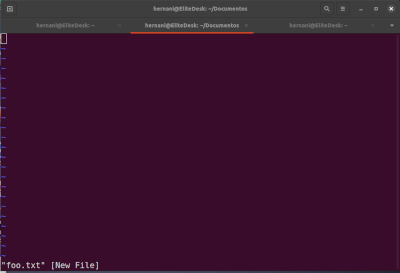

# <p style="text-align:center;color:red">12</p>
# <p style="text-align:center;color:red">A gentle introduction to vi<br /><span style="color:brown"></span></p>

There is an old joke about a visitor to New York City asking a passerby for directions to the city’s famous classical music venue.<br /><span style="color:brown"></span>

Visitor: Excuse me, how do I get to Carnegie Hall?<br /><span style="color:brown"></span>

Passerby: Practice, practice, practice!<br /><span style="color:brown"></span>

Learning the Linux command line, like becoming an accomplished pianist, is not something that we pick up in an afternoon. It takes years of practice. In this chapter, we will introduce the vi (pronounced “vee eye”) text editor, one of the core programs in the Unix tradition. vi is somewhat notorious for its difficult user interface, but when we see a master sit down at the keyboard and begin to “play,” we will indeed be witness to some great art. We won’t become masters in this chapter, but when we are done, we will know how to play the equivalent of “Chopsticks” in vi.<br /><span style="color:brown"></span>


# Why We Should Learn vi<br /><span style="color:yellow"></span>

In this modern age of graphical editors and easy-to-use text-based editors such as nano , why should we learn vi ? There are three good reasons.<br /><span style="color:brown"></span>

* vi is almost always available. If we have a system with no graphical interface, such as a remote server or a local system with a broken X configuration, this can be a lifesaver. nano , while increasingly popular, is still not universal. POSIX, a standard for program compatibility on Unix systems, requires that vi be present.<br /><span style="color:brown"></span>

* vi is lightweight and fast. For many tasks, it’s easier to bring up vi than it is to find the graphical text editor in the menus and wait for its multiple megabytes to load. In addition, vi is designed for typing speed. As we will see, a skilled vi user never has to lift their fingers from the keyboard while editing.<br /><span style="color:brown"></span>

* We don’t want other Linux and Unix users to think we are cowards.<br /><span style="color:brown"></span>

Okay, maybe two good reasons.<br /><span style="color:brown"></span>

# A Little Background<br /><span style="color:yellow"></span>

The first version of vi was written in 1976 by Bill Joy, a University of Cali­ fornia at Berkeley student who later went on to cofound Sun Microsystems.<br /><span style="color:brown"></span>

vi derives its name from the word “visual,” because it was intended to allow editing on a video terminal with a moving cursor. Previous to visual editors, there were line editors that operated on a single line of text at a time. To specify a change, we tell a line editor to go to a particular line and describe what change to make, such as adding or deleting text. With the advent of video terminals (rather than printer-based terminals like teletypes), visual editing became possible. vi actually incorporates a powerful line editor called ex , and we can use line editing commands while using vi.<br /><span style="color:brown"></span>

Most Linux distributions don’t include real vi ; rather, they ship with an enhanced replacement called vim (which is short for “vi improved”) written by Bram Moolenaar. vim is a substantial improvement over traditional Unix vi and is usually symbolically linked (or aliased) to the name vi on Linux systems. In the discussions that follow, we will assume that we have a program called vi that is really vim.<br /><span style="color:brown"></span>

# Starting and Stopping vi<br /><span style="color:brown"></span>

To start vi , we simply enter the following:<br /><span style="color:brown"></span>

`[me@linuxbox ~]$ vi`

A screen like the following should appear.<br /><span style="color:brown"></span>

```
~                                                                               
~                                                                               
~                              VIM - Vi IMproved                                
~                                                                               
~                               version 8.1.2269                                
~                           by Bram Moolenaar et al.                            
~                   Modified by team+vim@tracker.debian.org                     
~                 Vim is open source and freely distributable                   
~                                                                               
~                        Help poor children in Uganda!                          
~                type  :help iccf<Enter>       for information                  
~                                                                               
~                type  :q<Enter>               to  xit                          
~                type  :help<Enter>  or  <F1>  for on-line help                 
~                type  :help version8<Enter>   for version info                 
~                                                                               
~                        Running in Vi compatible mode                          
~                type  :set nocp<Enter>        for Vim defaults                 
~                type  :help cp-default<Enter> for info on this                 
~                                                                               
~                                                                               
~                                                                              
```

_________

> # Compatibility Mode<br /><span style="color:yellow"></span>

> In the example startup screen, we see the text “Running in Vi compatible mode.” This means that vim will run in a mode that is closer to the normal behavior of vi rather than the enhanced behavior of vim . For the purposes of this chapter, we will want to run vim with its enhanced behavior. To do this, you have a few options. Try running vim instead of vi . If that works, consider adding alias vi='vim' to your .bashrc file. Alternatively, use this command to add a line to your vim configuration file:<br /><span style="color:brown"></span>

> `echo "set nocp" >> ~/.vimrc`

> Different Linux distributions package vim in different ways. Some distributions install a minimal version of vim by default that supports only a limited set of vim features. While performing the lessons that follow, you may encounter missing features. If this is the case, install the full version of vim.<br /><span style="color:brown"></span>

_________

Just as we did with nano earlier, the first thing to learn is how to exit. To exit, we enter the following command (note that the colon character is part of the command):<br /><span style="color:brown"></span>

`:q`

The shell prompt should return. If, for some reason, vi will not quit (usually because we made a change to a file that has not yet been saved), we can tell vi that we really mean it by adding an exclamation point to the command.<br /><span style="color:brown"></span>

`:q!`
__________

> # Tip<br /><span style="color:red"></span>

> If you get “lost” in vi , try pressing the esc key twice to find your way again.<br /><span style="color:brown"></span>
______________

# Editing Modes<br /><span style="color:yellow"></span>

Let’s start vi again, this time passing the name of a nonexistent file to it. This is how we can create a new file with vi:<br /><span style="color:brown"></span>

```
[me@linuxbox ~]$ rm -f foo.txt
[me@linuxbox ~]$ vi foo.txt
```

If all goes well, we should get a screen like this:<br /><span style="color:brown"></span>



The leading tilde characters ( ~ ) indicate that no text exists on that line. This shows that we have an empty file. Do not type anything yet!<br /><span style="color:brown"></span>

The second most important thing to learn about vi (after learning how to exit) is that vi is a modal editor. When vi starts, it begins in command mode.<br /><span style="color:brown"></span>

In this mode, almost every key is a command, so if we were to start typing, vi would basically go crazy and make a big mess.<br /><span style="color:brown"></span>

# Entering Insert Mode<br /><span style="color:yellow"></span>

To add some text to our file, we must first enter insert mode. To do this, we press the i key. Afterward, we should see the following at the bottom of the screen if vim is running in its usual enhanced mode (this will not appear in vi compatible mode):<br /><span style="color:brown"></span>

`-- INSERT --`

Now we can enter some text. Try this:<br /><span style="color:brown"></span>

`The quick brown fox jumped over the lazy dog.`

To exit insert mode and return to command mode, press the esc key.<br /><span style="color:brown"></span>

# Saving Our Work<br /><span style="color:yellow"></span>

To save the change we just made to our file, we must enter an ex command while in command mode. This is easily done by pressing the : key. After doing this, a colon character should appear at the bottom of the screen.<br /><span style="color:brown"></span>

`:`

To write our modified file, we follow the colon with a w and then press enter.<br /><span style="color:brown"></span>

`:w`

The file will be written to the hard drive, and we should get a confirmation message at the bottom of the screen, like this:<br /><span style="color:brown"></span>

`"foo.txt" [New] 1L, 46C written`

____

> # Tip<br /><span style="color:red"></span>

> If you read the vim documentation, you will notice that (confusingly) command mode is called normal mode and ex commands are called command mode. Beware.<br /><span style="color:brown"></span>

____

# Moving the Cursor Around<br /><span style="color:yellow"></span>

While in command mode, vi offers a large number of movement commands, some of which it shares with less . Table 12-1 lists a subset.<br /><span style="color:brown"></span>

> Table 12-1: Cursor Movement Keys<br /><span style="color:brown"></span>
| Key | Moves the cursor|
|------|----------------|
| l or right arrow | Right one character.<br /><span style="color:brown"></span>|
| h or left arrow | Left one character.<br /><span style="color:brown"></span>|
| j or down arrow | Down one line.<br /><span style="color:brown"></span>|
| k or up arrow | Up one line.<br /><span style="color:brown"></span> |
| 0 (zero) | To the beginning of the current line.<br /><span style="color:brown"></span> |
| ^ | To the first non-whitespace character on the current line.<br /><span style="color:brown"></span>|
| $ | To the end of the current line.<br /><span style="color:brown"></span>| 
| w | To the beginning of the next word or punctuation character.<br /><span style="color:brown"></span>|
| W | To the beginning of the next word, ignoring punctuation characters.<br /><span style="color:brown"></span>|
| b | To the beginning of the previous word or punctuationcharacter.<br /><span style="color:brown"></span>| 
| B | To the beginning of the previous word, ignoring punctuation characters.<br /><span style="color:brown"></span>|
| ctrl-F or page down | Down one page.<br /><span style="color:brown"></span>|
| ctrl-B or page up | Up one page.<br /><span style="color:brown"></span>|
| numberG | To line number. For example, 1G moves to the first line of the file.<br /><span style="color:brown"></span>|
| G | To the last line of the file.<br /><span style="color:brown"></span>|

______


Why are the h , j , k , and l keys used for cursor movement? When vi was originally written, not all video terminals had arrow keys, and skilled typists could use regular keyboard keys to move the cursor without ever having to lift their fingers from the keyboard.<br /><span style="color:brown"></span>

Many commands in vi can be prefixed with a number, as with the G command listed in Table 12-1. By prefixing a command with a number, we may specify the number of times a command is to be carried out. For example, the command 5j causes vi to move the cursor down five lines.<br /><span style="color:brown"></span>

# Basic Editing<br /><span style="color:yellow"></span>

Most editing consists of a few basic operations such as inserting text, deleting text, and moving text around by cutting and pasting. vi , of course, supports all of these operations in its own unique way. vi also provides a limited form of undo. If we press the u key while in command mode, vi will undo the last change that you made. This will come in handy as we try some of the basic editing commands.<br /><span style="color:brown"></span>

# Appending Text<br /><span style="color:yellow"></span>

vi has several different ways of entering insert mode. We have already used the i command to insert text.<br /><span style="color:brown"></span>

Let's go back to our foo.txt file for a moment.<br /><span style="color:brown"></span>

`The quick brown fox jumped over the lazy dog.`

If we wanted to add some text to the end of this sentence, we would discover that the i command will not do it, because we can’t move the cursor beyond the end of the line. vi provides a command to append text, the sensibly-named a command. If we move the cursor to the end of the line and type a , the cursor will move past the end of the line and vi will enter insert mode. This will allow us to add some more text.<br /><span style="color:brown"></span>

`The quick brown fox jumped over the lazy dog. It was cool.`

Remember to press the esc key to exit insert mode.<br /><span style="color:brown"></span>

Because we will almost always want to append text to the end of a line, vi offers a shortcut to move to the end of the current line and start appending. It’s the A command. Let’s try it and add some more lines to our file.<br /><span style="color:brown"></span>

First, we’ll move the cursor to the beginning of the line using the 0 (zero) command. Now we type A and add the following lines of text:<br /><span style="color:brown"></span>

```
The quick brown fox jumped over the lazy dog. It was cool.
Line 2
Line 3
Line 4
Line 5
```

Again, press the esc key to exit insert mode.<br /><span style="color:brown"></span>

As we can see, the A command is more useful as it moves the cursor to the end of the line before starting insert mode.<br /><span style="color:brown"></span>

# Opening a Line<br /><span style="color:yellow"></span>

Another way we can insert text is by “opening” a line. This inserts a blank line between two existing lines and enters insert mode. This has two variants, as described in Table 12-2.<br /><span style="color:brown"></span>

> Table 12-2: Line Opening Keys<br /><span style="color:brown"></span>
| Command | Opens |
|---------|-------|
| o | The line below the current line <br /><span style="color:brown"></span>|
| O | The line above the current line<br /><span style="color:brown"></span>| 
____

We can demonstrate this as follows: place the cursor on line 3 and then type o.<br /><span style="color:brown"></span>

```
The quick brown fox jumped over the lazy dog. It was cool.
Line 2
Line 3

Line 4
Line 5
```

A new line was opened below the third line, and we entered insert mode.<br /><span style="color:brown"></span>

Exit insert mode by pressing the esc key. Press u to undo our change.<br /><span style="color:brown"></span>

Type O to open the line above the cursor.<br /><span style="color:brown"></span>

```
The quick brown fox jumped over the lazy dog. It was cool.
Line 2

Line 3
Line 4
Line 5
```

Exit insert mode by pressing esc , and undo our change by typing u.<br /><span style="color:brown"></span>

# Deleting Text<br /><span style="color:yellow"></span>

As we might expect, vi offers a variety of ways to delete text, all of which contain one of two keystrokes. First, the x command will delete a character at the cursor location. x may be preceded by a number specifying how many characters are to be deleted. The d command is more general purpose. Like x , it may be preceded by a number specifying the number of times the deletion is to be performed. In addition, d is always followed by a movement command that controls the size of the deletion. Table 12-3 provides some examples.<br /><span style="color:brown"></span>

> Table 12-3: Text Deletion Commands<br /><span style="color:brown"></span>
| Command | Deletes| 
|---------|----------|
| x | The current character<br /><span style="color:brown"></span>|
| 3x | The current character and the next two characters<br /><span style="color:brown"></span>| 
| dd | The current line<br /><span style="color:brown"></span>| 
| 5dd | The current line and the next four lines<br /><span style="color:brown"></span>|
| dW | From the current cursor position to the beginning of the next word <br /><span style="color:brown"></span>|
| d$ | From the current cursor location to the end of the current line<br /><span style="color:brown"></span> |
| d0 | From the current cursor location to the beginning of the line<br /><span style="color:brown"></span> |
| d^ | From the current cursor location to the first non-whitespace character in the line<br /><span style="color:brown"></span>| 
| dG | From the current line to the end of the file<br /><span style="color:brown"></span> | 
| d20G | From the current line to the twentieth line of the file<br /><span style="color:brown"></span> |

____________

Place the cursor on the word It on the first line of our text. Press the x key repeatedly until the rest of the sentence is deleted. Next, press the u key repeatedly until the deletion is undone.<br /><span style="color:brown"></span>
__________

> # Note<br /><span style="color:yellow"></span>

> Real vi supports only a single level of undo. vim supports multiple levels.<br /><span style="color:brown"></span>
_______

Let’s try the deletion again, this time using the d command. Again, move the cursor to the word It and type dW to delete the word.<br /><span style="color:brown"></span>

```
The quick brown fox jumped over the lazy dog. was cool.
Line 2
Line 3
Line 4
Line 5
```

Type d$ to delete from the cursor position to the end of the line.<br /><span style="color:brown"></span>

```
The quick brown fox jumped over the lazy dog.
Line 2
Line 3
Line 4
Line 5
```

Type dG to delete from the current line to the end of the file.<br /><span style="color:brown"></span>

Type u three times to undo the deletion.<br /><span style="color:brown"></span>

# Cutting, Copying, and Pasting Text<br /><span style="color:yellow"></span>

The d command not only deletes text, it also “cuts” text. Each time we use the d command, the deletion is copied into a paste buffer (think clipboard) that we can later recall with the p command to paste the contents of the buffer either before or after the cursor.<br /><span style="color:brown"></span>

The y command is used to “yank” (copy) text in much the same way the d command is used to cut text. Table 12-4 provides some examples of combining the y command with various movement commands.<br /><span style="color:brown"></span>

> Table 12-4: Yanking Commands
| Command | Copies |
|---------|--------|
| yy | The current line <br /><span style="color:brown"></span>|
| 5yy | The current line and the next four lines <br /><span style="color:brown"></span>|
| yW | From the current cursor position to the beginning of the next word<br /><span style="color:brown"></span> |
| y$ | From the current cursor location to the end of the current line <br /><span style="color:brown"></span>|
| y0 | From the current cursor location to the beginning of the line <br /><span style="color:brown"></span>|
| y^ | From the current cursor location to the first non-whitespace character in the line <br /><span style="color:brown"></span>|
| yG | From the current line to the end of the file <br /><span style="color:brown"></span>|
| y20G | From the current line to the twentieth line of the file <br /><span style="color:brown"></span>|

_____

Let’s try some copy-and-paste. Place the cursor on the first line of the text and type yy to copy the current line. Next, move the cursor to the last line ( G ) and type p to paste the line below the current line.<br /><span style="color:brown"></span>

```
The quick brown fox jumped over the lazy dog. It was cool.
Line 2
Line 3
Line 4
Line 5
The quick brown fox jumped over the lazy dog. It was cool.
```

Just as before, the u command will undo our change. With the cursor still positioned on the last line of the file, type P to paste the text above the current line.<br /><span style="color:brown"></span>

```
The quick brown fox jumped over the lazy dog. It was cool.
Line 2
Line 3
Line 4
The quick brown fox jumped over the lazy dog. It was cool.
Line 5
```

Try some of the other y commands in Table 12-4 and get to know the behavior of both the p and P commands. When you are done, return the file to its original state.<br /><span style="color:brown"></span>

# Joining Lines<br /><span style="color:yellow"></span>

vi is rather strict about its idea of a line. Normally, it is not possible to move the cursor to the end of a line and delete the end-of-line character to join one line with the one below it. Because of this, vi provides a specific command, J (not to be confused with j , which is for cursor movement), to join lines together.<br /><span style="color:brown"></span>

If we place the cursor on line 3 and type the J command, here’s what happens:<br /><span style="color:brown"></span>

```
The quick brown fox jumped over the lazy dog. It was cool.
Line 2
Line 3 Line 4
Line 5
```

# Search-and-Replace<br /><span style="color:yellow"></span>

vi has the capability to move the cursor to locations based on searches. It can do this either on a single line or over an entire file. It can also perform text replacements with or without confirmation from the user.<br /><span style="color:brown"></span>

# Searching Within a Line<br /><span style="color:yellow"></span>

The f command searches a line and moves the cursor to the next instance of a specified character. For example, the command fa would move the cursor to the next occurrence of the character a within the current line. After performing a character search within a line, the search may be repeated by typing a semicolon.<br /><span style="color:brown"></span>

# Searching the Entire File<br /><span style="color:yellow"></span>

To move the cursor to the next occurrence of a word or phrase, the / command is used. This works the same way as we learned earlier in the less program. When you type the / command, a / will appear at the bottom of the screen. Next, type the word or phrase to be searched for, followed by the enter key. The cursor will move to the next location containing the search string. A search may be repeated using the previous search string with the n command. Here’s an example:<br /><span style="color:brown"></span>

```
The quick brown fox jumped over the lazy dog. It was cool.
Line 2
Line 3
Line 4
Line 5
``` 

Place the cursor on the first line of the file. Type this and press enter:<br /><span style="color:brown"></span>

`/Line`

The cursor will move to line 2. Next, type n and the cursor will move to line 3. Repeating the n command will move the cursor down the file until it runs out of matches. While we have so far used only words and phrases for our search patterns, vi allows the use of regular expressions, a powerful method of expressing complex text patterns. We will cover regular expressions fully in Chapter 19.<br /><span style="color:brown"></span>

# Global Search-and-Replace<br /><span style="color:yellow"></span>

vi uses an ex command to perform search-and-replace operations (called substitution in vi ) over a range of lines or the entire file. To change the word Line to line for the entire file, we would enter the following command:<br /><span style="color:brown"></span>

`:%s/Line/line/g`

Let’s break down this command into separate items and see what each one does (see Table 12-5).<br /><span style="color:brown"></span>

> Table 12-5: An Example of Global Search-and-Replace Syntax<br /><span style="color:brown"></span>
| Item | Meaning |
|------|---------|
| : | The colon character starts an ex command.<br /><span style="color:brown"></span>|
| % | This specifies the range of lines for the operation. % is a shortcut meaning from the first line to the last line. Alternately, the range could have been specified 1,5 (since our file is five lines long) or 1,$ , which means “from line 1 to the last line in the file.” If the range of lines is omitted, the operation is performed only on the current line.<br /><span style="color:brown"></span>|
| s | This specifies the operation. In this case, it’s substitution (search-and-replace).<br /><span style="color:brown"></span>|
| /Line/line/ | This specifies the search pattern and the replacement text.<br /><span style="color:brown"></span>|
| g | This means “global” in the sense that the search-and-replace is performed on every instance of the search string in the line. If omitted, only the first instance of the search string on each line is replaced.<br /><span style="color:brown"></span>| 
__________

After executing our search-and-replace command, our file looks like this:<br /><span style="color:brown"></span>

```
The quick brown fox jumped over the lazy dog. It was cool.
line 2
line 3
line 4
line 5
```

We can also specify a substitution command with user confirmation.<br /><span style="color:brown"></span>

This is done by adding a c to the end of the command. Here’s an example:<br /><span style="color:brown"></span>

`:%s/line/Line/gc`

This command will change our file back to its previous form; however, before each substitution, vi stops and asks us to confirm the substitution with this message:<br /><span style="color:brown"></span>

`replace with Line (y/n/a/q/l/^E/^Y)?`

Each of the characters within the parentheses is a possible choice, as described in Table 12-6.<br /><span style="color:brown"></span>

> Table 12-6: Replace Confirmation Keys<br /><span style="color:brown"></span>
| Key | Action |
|-----|--------|
| y | Perform the substitution.<br /><span style="color:brown"></span>|
| n | Skip this instance of the pattern.<br /><span style="color:brown"></span>|
| a | Perform the substitution on this and all subsequent instances of the pattern.<br /><span style="color:brown"></span>|
| q or esc | Quit substituting.<br /><span style="color:brown"></span>|
| l  |Perform this substitution and then quit. This is short for “last.”<br /><span style="color:brown"></span>|
| ctrl-E, ctrl-Y | Scroll down and scroll up, respectively. This is useful for viewing the context of the proposed substitution.<br /><span style="color:brown"></span>| 
______

If you type y , the substitution will be performed. n will cause vi to skip this instance and move on to the next one.<br /><span style="color:brown"></span>

# Editing Multiple Files<br /><span style="color:yellow"></span>

It’s often useful to edit more than one file at a time. You might need to make changes to multiple files, or you might need to copy content from one file into another. With vi we can open multiple files for editing by specifying them on the command line.<br /><span style="color:brown"></span>

`vi file1 file2 file3 . . .`

Let’s exit our existing vi session and create a new file for editing. Type :wq to exit vi , saving our modified text. Next, we’ll create an additional file in our home directory that we can play with. We’ll create the file by capturing some output from the ls command.<br /><span style="color:brown"></span>

`[me@linuxbox ~]$ ls -l /usr/bin > ls-output.txt`

Let’s edit our old file and our new one with vi.<br /><span style="color:brown"></span>

`[me@linuxbox ~]$ vi foo.txt ls-output.txt`

vi will start, and we will see the first file on the screen.<br /><span style="color:brown"></span>

```
The quick brown fox jumped over the lazy dog. It was cool.
Line 2
Line 3
Line 4
Line 5
Switching Between Files
```

To switch from one file to the next, use this ex command:<br /><span style="color:brown"></span>

`:bn`

To move back to the previous file, use the following:<br /><span style="color:brown"></span>

`:bp`

While we can move from one file to another, vi enforces a policy that prevents us from switching files if the current file has unsaved changes. To force vi to switch files and abandon your changes, add an exclamation point ( ! ) to the command.<br /><span style="color:brown"></span>

In addition to the switching method already described, vim (and some versions of vi ) provides some ex commands that make multiple files easier to manage. We can view a list of files being edited with the :buffers command. Doing so will display a list of the files at the bottom of the display.<br /><span style="color:brown"></span>

```
:buffers
1 %a    "foo.txt"           line 1
2       "ls-output.txt"     line 0
Press ENTER or type command to continue
```

To switch to another buffer (file), type :buffer followed by the number of the buffer you want to edit. For example, to switch from buffer 1 containing the file foo.txt to buffer 2 containing the file ls-output.txt, we would type this:<br /><span style="color:brown"></span>

`:buffer 2`

Our screen now displays the second file. Another way we can change buffers is to use the :bn (short for buffer next) and :bp (short for buffer previous) commands mentioned earlier.<br /><span style="color:brown"></span>

# Opening Additional Files for Editing<br /><span style="color:yellow"></span>

It’s also possible to add files to our current editing session. The ex command :e (short for “edit”) followed by a filename will open an additional file. Let’s end our current editing session and return to the command line.<br /><span style="color:brown"></span>

Start vi again with just one file.<br /><span style="color:brown"></span>

`[me@linuxbox ~]$ vi foo.txt`

To add our second file, enter the following:<br /><span style="color:brown"></span>

`:e ls-output.txt`

It should appear on the screen. The first file is still present, as we can verify.<br /><span style="color:brown"></span>

```
:buffers
1 #     "foo.txt"           line 1
2 %a    "ls-output.txt"     line 0
Press ENTER or type command to continue
```

# Copying Content from One File into Another<br /><span style="color:yellow"></span>

Often while editing multiple files, we will want to copy a portion of one file into another file that we are editing. This is easily done using the usual yank and paste commands we used earlier. We can demonstrate as follows. First, using our two files, switch to buffer 1 (foo.txt) by entering this:<br /><span style="color:brown"></span>

`:buffer 1`

That command should give us this:<br /><span style="color:brown"></span>

```
The quick brown fox jumped over the lazy dog. It was cool.
Line 2
Line 3
Line 4
Line 5
```

Next, move the cursor to the first line, and type yy to yank (copy) the line.<br /><span style="color:brown"></span>

Switch to the second buffer by entering the following:<br /><span style="color:brown"></span>

`:buffer 2`

The screen will now contain some file listings like this (only a portion is shown here):<br /><span style="color:brown"></span>

```
total 343700
-rwxr-xr-x 1    root    root    31316   2017-12-05 08:58    [
-rwxr-xr-x 1    root    root    8240    2017-12-09 13:39    411toppm
-rwxr-xr-x 1    root    root    111276  2018-01-31 13:36    a2p
-rwxr-xr-x 1    root    root    25368   2017-10-06 20:16    a52dec
-rwxr-xr-x 1    root    root    11532   2017-05-04 17:43    aafire
-rwxr-xr-x 1    root    root    7292    2017-05-04 17:43    aainfo

```

Move the cursor to the first line and paste the line we copied from the preceding file by typing the p command.<br /><span style="color:brown"></span>

```
total 343700
The quick brown fox jumped over the lazy dog.
total 343700
-rwxr-xr-x 1    root    root    31316   2017-12-05 08:58    [
-rwxr-xr-x 1    root    root    8240    2017-12-09 13:39    411toppm
-rwxr-xr-x 1    root    root    111276  2018-01-31 13:36    a2p
-rwxr-xr-x 1    root    root    25368   2017-10-06 20:16    a52dec
-rwxr-xr-x 1    root    root    11532   2017-05-04 17:43    aafire
-rwxr-xr-x 1    root    root    7292    2017-05-04 17:43    aainfo
```

# Inserting an Entire File into Another<br /><span style="color:yellow"></span>

It’s also possible to insert an entire file into one we are editing. To see this in action, let’s end our vi session and start a new one with just a single file.<br /><span style="color:brown"></span>

`[me@linuxbox ~]$ vi ls-output.txt`

We will see our file listing again.<br /><span style="color:brown"></span>

Move the cursor to the third line and then enter the following ex command:<br /><span style="color:brown"></span>

`:r foo.txt`

The :r command (short for “read”) inserts the specified file below the cursor position. Our screen should now look like this:<br /><span style="color:brown"></span>

# Saving Our Work<br /><span style="color:yellow"></span>

Like everything else in vi , there are several different ways to save our edited files. We have already covered the ex command :w , but there are some others we may also find helpful.<br /><span style="color:brown"></span>

In command mode, typing ZZ will save the current file and exit vi.<br /><span style="color:brown"></span>

Likewise, the ex command :wq will combine the :w and :q commands into one that will both save the file and exit.<br /><span style="color:brown"></span>

The :w command may also specify an optional filename. This acts like Save As. For example, if we were editing foo.txt and wanted to save an alternate version called foo1.txt, we would enter the following:<br /><span style="color:brown"></span>

`:w foo1.txt`

> # Note<br /><span style="color:red"></span>

> While this command saves the file under a new name, it does not change the name of the file you are editing. As you continue to edit, you will still be editing foo.txt, not foo1.txt.<br /><span style="color:brown"></span>


# Summing Up<br /><span style="color:yellow"></span>

With this basic set of skills, we can now perform most of the text editing needed to maintain a typical Linux system. Learning to use vim on a regular basis will pay off in the long run. Since vi -style editors are so deeply embedded in Unix culture, we will see many other programs that have been influenced by its design. less is a good example of this influence.<br /><span style="color:brown"></span>
